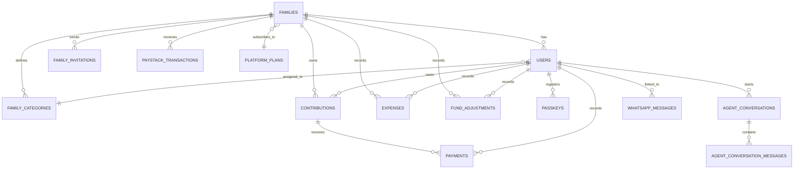

# CHAPTER THREE

## METHODOLOGY

### 3.1 Introduction

This chapter describes the methodology used for the design, development, testing, and proposed deployment of FamilyFunds, an AI-enhanced multi-tenant family fund management system. Chapter Two established the theoretical and empirical basis for the project: informal family contribution funds remain important in Nigeria, but the tools available for managing them are either manual, individual-focused, or designed for formal financial institutions. This chapter turns that background into a concrete system plan.

The methodology combines system design, iterative software development, database modelling, process modelling, interface design, security planning, and evaluation. The approach is practical rather than purely theoretical. The system is designed as a working web application with real users in mind: family administrators, financial secretaries, ordinary members, and a platform super administrator. Because the problem involves both financial records and trust between family members, the methodology gives special attention to tenant isolation, role-based access control, payment accuracy, auditability, and understandable reporting.

The chapter is organised into twelve sections. It begins with an overview of the proposed system, then explains the development approach adopted. It presents the functional and non-functional requirements, describes the system architecture, explains the database, process, and interface design, identifies the modelling tools used, and outlines the implementation technologies. It also describes the testing and validation strategy, deployment plan, evaluation metrics, and a summary of the methodology.

### 3.2 System Overview

FamilyFunds is a web-based platform for managing family contribution funds. The system is proposed to solve a specific problem: many Nigerian families collect monthly contributions for shared expenses, but the records are often kept in notebooks, spreadsheets, or messaging groups. These methods are easy to start but difficult to trust over time. They do not handle partial payments consistently, they provide little audit trail, and they make it hard for members to verify their own status without asking the person managing the money.

The proposed system provides a secure, organised, and intelligent alternative. Each family operates as a separate tenant on the platform, meaning that one family cannot view or interfere with another family's financial data. Within each family, access is controlled by roles. A Family Administrator manages family settings, members, contribution categories, invitations, and subscription decisions. A Financial Secretary records payments, expenses, and adjustments, sends reminders, and generates reports. A Member views personal contribution status, pays online where available, and receives notifications.

At the centre of the system is contribution tracking. The system generates monthly contribution obligations for paying members according to their assigned category. Because family members may have different financial capacities, the design supports tiered contribution categories such as employed, unemployed, student, or any custom category defined by the family. When a member pays less than the full amount, or pays an amount covering several months at once, the system applies an oldest-balance-first allocation rule. The oldest unpaid contribution is completed first before newer months are credited. This removes the ambiguity that often occurs in manual record-keeping.

The proposed system also includes online payment processing through Paystack, manual payment entry for cash or bank-transfer records, expense recording, fund adjustments, reports, email and WhatsApp reminders, subscription management, and security features such as email verification, two-factor authentication, and WebAuthn passkeys. The AI-enhanced layer supports intelligent assistance, plain-language report summaries, and proposed predictive analytics for identifying members who may be likely to default. These AI capabilities extend the system beyond basic CRUD operations and connect it to the research gap identified in Chapter Two.

The major features of FamilyFunds are summarised in Table 3.1.

*Table 3.1: Summary of Proposed System Features*

| Feature Area | Description |
| --- | --- |
| Multi-tenant family management | Each family has a separate operational space with logically isolated data. |
| Role-based access control | Administrators, Financial Secretaries, Members, and Platform Super Admins have different permissions. |
| Contribution tracking | Monthly obligations are generated for members based on their contribution category. |
| Payment allocation | Partial and lump-sum payments are allocated to the oldest outstanding balances first. |
| Online payments | Members can pay through Paystack, while authorised officers can record offline payments manually. |
| Expenses and adjustments | Family expenses, donations, corrections, and non-contribution inflows can be recorded. |
| Notifications and reminders | Email and WhatsApp reminders can be sent to improve payment follow-up. |
| Reports | Monthly and annual reports show collection status, payments, expenses, and balances. |
| AI assistance and reporting | An AI assistant supports financial questions and proposed plain-language report summaries. |
| Predictive analytics | A proposed analytics module estimates default risk using historical payment behaviour. |
| Security | Email verification, password hashing, two-factor authentication, passkeys, signed invitations, and tenant scoping protect user data. |
| Subscription management | Families can subscribe to platform plans with different limits and feature access. |

### 3.3 Research/Development Approach

The development approach selected for this project is an Agile and iterative Software Development Life Cycle (SDLC). Agile development is suitable when requirements are expected to evolve through feedback, learning, and repeated refinement, especially where functional features and quality requirements must be balanced throughout development (Masood et al., 2020; Karhapää et al., 2021). That is the case in this project. The problem did not come from a fictional case study. It came from the researcher's direct observation of family fund management, where requirements emerge from real scenarios: partial payments, late payments, different contribution categories, disputes about balances, and the need for reports that non-technical family members can understand.

A strict Waterfall model would require all requirements to be fixed before implementation begins. That does not match the nature of this project. The requirements for family fund management are practical and sometimes messy. A family may decide that students should contribute a smaller amount, that reminders should be sent before a due date, or that a financial secretary should record bank transfers on behalf of older members. These discoveries are easier to handle through short cycles of design, implementation, feedback, and improvement.

The Agile/Iterative approach used in this project follows five broad phases:

1. **Requirement identification.** The problem was studied through observation of manual family contribution practices and through the gaps identified in the literature review.
2. **System design.** The architecture, database entities, roles, payment processes, and security mechanisms were modelled before implementation.
3. **Incremental development.** Core modules such as authentication, family management, contributions, payments, expenses, reports, and AI features are developed in manageable iterations.
4. **Testing and validation.** Each major module is tested using unit, integration, feature, and system-level tests.
5. **Evaluation and refinement.** The finished system is evaluated against the objectives, research questions, and metrics defined for the project.

This approach also aligns with the Model-View-Controller pattern discussed in Chapter Two. The backend models represent the system data, controllers coordinate requests and business logic, and the Vue/Inertia interface presents the system to users. This separation supports iterative development because each part of the system can be improved without rewriting the whole application.

### 3.4 System Requirements

System requirements define what the proposed system must do and the qualities it must maintain while doing it. They are divided into functional requirements and non-functional requirements.

#### 3.4.1 Functional Requirements

Functional requirements describe the visible behaviours and features of the system. For FamilyFunds, these requirements are driven by the problems identified in Chapters One and Two: unreliable records, weak governance, unclear payment allocation, limited reporting, and lack of intelligent financial support.

*Table 3.2: Functional Requirements*

| ID | Requirement | Description | Primary Users |
| --- | --- | --- | --- |
| FR-01 | User registration and authentication | The system shall allow users to register, log in, verify email addresses, reset passwords, and manage secure access. | All users |
| FR-02 | Family tenant creation | The system shall allow a family to create an isolated family workspace with its own name, currency, due day, and settings. | Family Admin |
| FR-03 | Member invitation | The system shall allow administrators to invite members using secure tokenised invitation links. | Family Admin |
| FR-04 | Role management | The system shall support Administrator, Financial Secretary, and Member roles within each family. | Family Admin |
| FR-05 | Platform administration | The system shall allow a platform super administrator to view families, users, plans, and platform-level settings. | Platform Super Admin |
| FR-06 | Contribution category setup | The system shall allow families to define contribution categories and monthly amounts. | Family Admin |
| FR-07 | Monthly contribution generation | The system shall generate monthly contribution records for paying members based on their category and due date. | Family Admin, Financial Secretary |
| FR-08 | Contribution status tracking | The system shall show whether a contribution is unpaid, partially paid, paid, or overdue. | All users |
| FR-09 | Manual payment recording | The system shall allow authorised users to record payments received outside the platform. | Family Admin, Financial Secretary |
| FR-10 | Online payment initiation | The system shall allow members to initiate online payments through Paystack where the family plan supports it. | Member |
| FR-11 | Payment allocation | The system shall allocate partial and lump-sum payments to the oldest outstanding contribution balance first. | System |
| FR-12 | Payment history | The system shall maintain a history of payments, dates, amounts, and who recorded each transaction. | All authorised users |
| FR-13 | Expense recording | The system shall allow authorised users to record family expenses with amount, description, and date. | Family Admin, Financial Secretary |
| FR-14 | Fund adjustments | The system shall allow authorised users to record non-contribution inflows or corrections, such as donations or balance adjustments. | Family Admin, Financial Secretary |
| FR-15 | Reports | The system shall generate monthly and annual financial reports showing contributions, payments, expenses, and balances. | Family Admin, Financial Secretary |
| FR-16 | Member dashboard | The system shall provide dashboard summaries showing contribution progress, recent payments, overdue members, and fund status. | All users |
| FR-17 | Notifications and reminders | The system shall support email and WhatsApp reminders for unpaid or overdue contributions. | Family Admin, Financial Secretary |
| FR-18 | Subscription management | The system shall allow families to subscribe to platform plans with feature and member-count limits. | Family Admin |
| FR-19 | AI assistant | The system shall provide an AI assistant capable of answering family-fund questions and performing permitted actions after confirmation. | All users, according to role |
| FR-20 | AI report summary | The system shall support plain-language financial report summaries for non-expert users. | Family Admin, Financial Secretary |
| FR-21 | Predictive analytics | The system shall provide proposed payment-behaviour prediction using historical contribution and payment records. | Family Admin, Financial Secretary |
| FR-22 | Audit-friendly record keeping | The system shall preserve financial records in a way that supports review and accountability. | All authorised users |

#### 3.4.2 Non-Functional Requirements

Non-functional requirements describe the qualities the system must maintain. For FamilyFunds, these are as important as the visible features because the system handles money-related records and personal information. Recent Agile requirements research stresses that quality requirements such as performance, security, reliability, and maintainability cannot be left until the end of development; they have to shape design choices from the beginning (Karhapää et al., 2021).

*Table 3.3: Non-Functional Requirements*

| Category | Requirement | Description |
| --- | --- | --- |
| Performance | Responsive dashboard and reports | Common pages such as the dashboard, contribution list, and reports should load quickly for normal family sizes. |
| Performance | Efficient queries | Data access should be scoped by family and optimised to avoid unnecessary loading of unrelated tenant data. |
| Security | Tenant isolation | A user from one family must not access another family's members, contributions, payments, expenses, or reports. |
| Security | Strong authentication | The system should support password hashing, email verification, two-factor authentication, and passkeys. |
| Security | Role enforcement | Only authorised roles should perform sensitive actions such as recording payments or changing family settings. |
| Security | Safe external integrations | Paystack and AI provider integrations should be controlled through environment configuration and secure callbacks. |
| Usability | Clear navigation | The interface should make common actions easy to find: payments, contributions, reports, members, and settings. |
| Usability | Plain-language reporting | Reports and AI summaries should be understandable to users without accounting or software backgrounds. |
| Usability | Mobile responsiveness | The system should work on common mobile and desktop browsers because many family members use smartphones. |
| Reliability | Accurate payment allocation | A payment should always be allocated deterministically using the oldest-balance-first rule. |
| Reliability | Scheduled tasks | Contribution generation and reminder jobs should run consistently at configured times. |
| Reliability | Recovery from failed services | Failed payment callbacks, email delivery issues, or AI provider errors should not corrupt financial records. |
| Maintainability | Modular design | The system should separate authentication, tenancy, contributions, payments, reports, and AI functionality. |
| Maintainability | Test coverage | Critical behaviour such as tenant isolation, payment allocation, and role permissions should be covered by automated tests. |
| Scalability | Multi-family support | The architecture should support many independent families on shared infrastructure through logical data isolation. |

### 3.5 System Architecture

FamilyFunds uses a web-based client-server architecture with a Laravel backend, Vue.js frontend, Inertia.js server-client bridge, MySQL relational database, and external service integrations. The system is designed as a modern monolithic application rather than as a set of microservices. This choice is deliberate. The project is broad enough to require clear separation of responsibilities, but not so large that a distributed microservice architecture would be justified. A modular monolith keeps development manageable while still allowing the application to separate business concerns cleanly.

The architecture is organised into five main layers:

1. **Presentation layer.** Users interact with the system through a Vue 3 single-page interface connected to Laravel routes through Inertia.js.
2. **Authentication and access layer.** Laravel Fortify, role checks, policies, middleware, two-factor authentication, and WebAuthn passkeys control identity and permissions.
3. **Application/business layer.** Controllers, services, jobs, commands, and AI tools handle contributions, payments, expenses, reports, notifications, subscriptions, and AI interactions.
4. **Data layer.** MySQL stores family, user, contribution, payment, expense, notification, subscription, passkey, WhatsApp, and AI conversation data.
5. **External service layer.** Paystack handles online payments and subscriptions, email/WhatsApp channels handle communication, and AI providers support intelligent assistant and report-summary features.

Figure 3.1 shows the proposed high-level architecture.


The architecture uses shared-schema multi-tenancy. This means that different families share the same application instance and database, but tenant-specific tables contain a `family_id` field where appropriate. Application middleware, policies, and query scoping enforce the rule that a user can only operate within the family to which they belong. Recent work on multi-tenant cloud and SaaS systems continues to identify isolation, resource sharing, and tenant-specific quality requirements as central architectural concerns (Jia et al., 2021; Sharma & Kaur, 2021). This design gives the project the cost and maintenance advantages of SaaS while still respecting the trust boundary between families.

### 3.6 System Design

System design explains how the proposed system is structured internally. It covers data design, process design, and interface design.

#### 3.6.1 Data Design

The database is designed around the family tenant. The `families` table represents each independent family group on the platform. Most financial records are linked either directly or indirectly to a family. This supports tenant isolation and makes it possible to generate reports for one family without mixing data from another.

The main entities are described in Table 3.4.

*Table 3.4: Major Database Entities*

| Entity | Purpose | Key Relationships |
| --- | --- | --- |
| `families` | Stores each family tenant, settings, due day, currency, bank details, suspension status, and subscription information. | Has many users, categories, contributions, expenses, adjustments, invitations, and transactions. |
| `users` | Stores platform users, family membership, role, contribution category, authentication details, and optional super-admin status. | Belongs to a family and optionally belongs to a family category. |
| `family_categories` | Stores custom contribution tiers and monthly amounts for a family. | Belongs to a family and may be assigned to users. |
| `family_invitations` | Stores pending invitations, roles, tokens, expiry dates, and acceptance status. | Belongs to a family and inviter user. |
| `contributions` | Stores monthly contribution obligations for members. | Belongs to a family and user; has many payments. |
| `payments` | Stores payments applied to specific contributions. | Belongs to a contribution and has a recorded-by user. |
| `expenses` | Stores family expenses and the user who recorded them. | Belongs to a family and recorded-by user. |
| `fund_adjustments` | Stores donations, corrections, and other non-contribution balance changes. | Belongs to a family and recorded-by user. |
| `paystack_transactions` | Stores online payment and subscription transaction records. | Belongs to a user and family. |
| `platform_plans` | Stores subscription plans, prices, member limits, Paystack plan codes, and feature sets. | Used by families for subscription management. |
| `passkeys` | Stores WebAuthn credential information for passkey authentication. | Belongs to a user. |
| `notifications` | Stores system notifications for users. | Polymorphic relationship to notifiable users. |
| `whatsapp_messages` | Stores inbound and outbound WhatsApp communication records. | Linked to family and user where applicable. |
| `agent_conversations` | Stores AI assistant conversation sessions. | Belongs to a user. |
| `agent_conversation_messages` | Stores AI conversation messages, tool calls, tool results, and metadata. | Belongs to an AI conversation and user. |

Figure 3.2 represents the database design at a high level. The actual database schema uses relational constraints and foreign keys where applicable, while application-level rules enforce role and tenant boundaries.



*Figure 3.2: Entity-Relationship Diagram*

The most important design decision in the database is that financial records remain traceable. A contribution belongs to a family and a member. A payment belongs to a contribution. An expense or adjustment belongs to a family and records who entered it. This structure makes it possible to reconstruct a member's balance, a family's total fund position, and the history of actions taken by authorised users.

#### 3.6.2 Process Design

The system contains several important processes: contribution generation, payment allocation, online payment handling, invitation acceptance, reminder delivery, report generation, and AI-assisted querying. The most critical process is payment allocation because it determines how money is credited against outstanding obligations.

The payment allocation algorithm follows an oldest-balance-first rule. This is similar to a First-In, First-Out queue: the earliest unpaid contribution is handled before newer ones. The purpose is not merely technical. It ensures fairness, transparency, and consistency. If a member owes January, February, and March, a payment received in March should not be randomly credited to March while January remains unclear. The system removes that ambiguity.

The payment allocation process is shown in Figure 3.3.


The algorithm can be expressed as follows:

```text
Input: member, payment amount, payment date, recorder

1. Retrieve all incomplete contributions for the member.
2. Sort contributions by year and month from oldest to newest.
3. Set remaining amount to the payment amount.
4. For each contribution:
      a. If remaining amount is zero, stop.
      b. Calculate the outstanding balance for the contribution.
      c. Apply the smaller of remaining amount and outstanding balance.
      d. Create a payment record for the amount applied.
      e. Reduce remaining amount.
5. If money remains after all existing balances are cleared:
      a. Create future monthly contribution records where needed.
      b. Apply the remaining amount month by month.
6. Update dashboards, reports, and notifications.
Output: one or more payment records linked to contribution records.
```

Other important processes are summarised below:

- **Contribution generation:** At the start of a month, the system creates contribution records for active paying members based on their category and the family's due day.
- **Online payment flow:** A member initiates payment, Paystack processes checkout, the callback/webhook validates transaction status, and the verified amount is passed to the allocation service.
- **Invitation flow:** An administrator sends an invitation, the invited user receives a tokenised link, the user accepts before expiry, and the account is attached to the family with the preassigned role.
- **Reminder flow:** The system identifies unpaid or partially paid contributions and sends reminders through configured email or WhatsApp channels.
- **Report flow:** The system aggregates contribution, payment, expense, and adjustment records into monthly or annual summaries.
- **AI assistant flow:** The user asks a question, the assistant checks the user's role and family context, calls only permitted tools, and returns an answer grounded in available family data.

#### 3.6.3 Interface Design

The interface is designed as a responsive single-page web application. The goal is to make the system usable by both technically confident users and ordinary family members who simply want to check their balance or pay their contribution. Recent responsive interface research emphasises consistency across screen sizes because users now move between phones, tablets, and computers when accessing the same system (Li et al., 2022). The interface therefore avoids exposing database complexity. It presents financial information through dashboards, lists, forms, status badges, and plain-language summaries.

The major screens include:

- **Welcome and authentication screens:** Registration, login, password reset, email verification, two-factor challenge, and invitation acceptance.
- **Dashboard:** A summary of contribution progress, recent payments, overdue members, and family fund position.
- **Members module:** Member listing, member creation, member profile, role/category assignment, and member editing.
- **Contributions module:** Contribution list, member contribution details, personal contribution view, and contribution generation.
- **Payments module:** Manual payment recording, payment history, and member self-payment through Paystack.
- **Expenses and fund adjustments:** Forms and lists for outgoing expenses, donations, corrections, and other fund movements.
- **Reports module:** Monthly and annual reports showing financial summaries, contribution status, and balances.
- **Family settings:** Family details, contribution categories, bank details, invitation management, and subscription settings.
- **Platform administration:** Platform-level dashboard, user management, family management, plans, and feature flags.
- **Security settings:** Profile management, password update, two-factor authentication, passkey registration, and WhatsApp verification.
- **AI assistant:** A chat-based interface for asking questions about the family's fund and generating role-permitted insights.

The interface is designed around role relevance. A Member should not be overwhelmed with administrative functions. A Financial Secretary needs fast access to payments, expenses, reports, and reminders. A Family Administrator needs member management, categories, subscription settings, and overall visibility. This role-sensitive design supports both usability and security.

### 3.7 Modeling Tools

Modelling tools are used to visualise the proposed system before and during implementation. They help explain how users interact with the system, how components are arranged, and how important processes flow.

The following modelling tools are used in this project:

- **Use Case Diagram:** Shows the main actors and what each actor can do in the system.
- **System Architecture Diagram:** Shows the layers of the system and the relationship between users, application components, database, and external services.
- **Entity-Relationship Diagram:** Represents the main database entities and relationships.
- **Activity/Flowchart Diagram:** Shows the steps in the payment allocation process.
- **Class-style Model Description:** Explains the relationship between major domain objects such as Family, User, Contribution, Payment, Expense, FundAdjustment, PlatformPlan, and Passkey.
- **Sequence-style Process Description:** Explains the order of interactions in processes such as online payment, invitation acceptance, and AI assistant queries.

Figure 3.4 presents the use-case view of the proposed system.


The use-case model identifies four main human actors: Platform Super Admin, Family Admin, Financial Secretary, and Member. It also includes external actors such as Paystack and AI providers. This makes the system boundary clear. Paystack does not manage family records; it only processes transactions. The AI provider does not own the family data; it receives controlled prompts or tool outputs for specific assistant functions. The Laravel application remains the authority for permissions, data, and financial records.

### 3.8 Implementation Details

The proposed system is implemented using a modern Laravel and Vue technology stack. The stack was selected because it supports rapid development, secure authentication, server-driven single-page application behaviour, and strong database-backed business logic.

*Table 3.5: Implementation Technologies*

| Category | Technology | Purpose |
| --- | --- | --- |
| Programming language | PHP 8.4 | Backend application development. |
| Backend framework | Laravel 13 | Routing, controllers, models, queues, scheduler, validation, policies, and services. |
| Frontend framework | Vue.js 3 | Interactive user interface. |
| Server-client bridge | Inertia.js 3 | Connects Laravel routes to Vue pages without a separate API layer. |
| Database | MySQL | Relational storage for families, users, contributions, payments, expenses, subscriptions, and AI records. |
| Styling | Tailwind CSS 4 | Responsive interface styling. |
| Authentication | Laravel Fortify | Login, registration, password reset, email verification, and two-factor authentication support. |
| Passwordless authentication | WebAuthn/passkeys | Strong device-based authentication using public-key credentials. |
| Payment gateway | Paystack | Online contribution payments and subscription billing. |
| AI integration | Laravel AI SDK | AI assistant, tool calling, conversation memory, and provider integration. |
| Feature flags | Laravel Pennant | Controlled release of advanced features such as AI assistance. |
| Testing | Pest PHP | Unit, feature, and system-oriented automated tests. |
| Build tool | Vite | Frontend asset compilation and development server. |
| Version control | Git | Source code tracking and collaboration. |
| Code quality | Laravel Pint, ESLint, Prettier | Formatting and style consistency. |
| Development environment | Composer, Node.js, npm | Dependency management and local development. |

Laravel is used for the backend because it provides mature support for routing, database modelling through Eloquent ORM, queues, scheduled tasks, form validation, policies, notifications, and authentication. Vue.js is used for the frontend because it supports reactive user interfaces and component-based development. Inertia.js connects these two layers without requiring a separate REST API, which keeps the project manageable for a single-developer final-year project while preserving the user experience of a single-page application (Reinink, 2024; You, 2024).

Paystack is selected because it is widely used for payment processing in Nigeria and supports the Naira-based payment context required by the project (Paystack, 2024). Laravel Fortify provides a secure foundation for authentication, while WebAuthn and two-factor authentication strengthen account protection; recent FIDO2 usability research shows why passwordless authentication is promising but still needs fallbacks for users who may not understand or support passkeys on every device (Lyastani et al., 2020; W3C, 2021). The Laravel AI SDK is used to connect AI providers and tool-based assistant functions while keeping application permissions under the system's control.

### 3.9 System Testing and Validation

Testing and validation are necessary because the system handles money-related records. A small error in payment allocation or tenant isolation could cause disputes, loss of trust, or exposure of private family data. Testing is therefore planned at multiple levels. AI features require additional validation because recent studies show that LLMs can produce outputs that are fluent but factually wrong or logically weak, especially in financial contexts (de Wynter et al., 2023; Kang & Liu, 2023).

*Table 3.6: Testing and Validation Plan*

| Test Type | What Will Be Tested | Expected Result |
| --- | --- | --- |
| Unit testing | Individual methods such as payment allocation, contribution status calculation, role helper methods, and amount formatting. | Each unit returns correct values for normal and edge cases. |
| Feature testing | End-to-end application behaviours such as member creation, contribution generation, payment recording, and report viewing. | Users can complete permitted workflows successfully. |
| Integration testing | Interaction between modules such as Paystack callbacks, payment allocation, notifications, and reports. | Data flows correctly between modules without duplication or corruption. |
| Tenant-isolation testing | Attempts by one family user to access another family's records. | Access is denied and no cross-family data is exposed. |
| Role-permission testing | Actions performed by Admin, Financial Secretary, Member, and Platform Super Admin roles. | Only authorised roles can perform sensitive actions. |
| Payment-allocation testing | Partial payments, overpayments, lump-sum payments, and future-month payments. | Payments are always allocated oldest-balance-first. |
| Security testing | Login, email verification, two-factor authentication, passkeys, invitation tokens, throttling, and webhook validation. | Authentication and sensitive flows reject invalid or unauthorised requests. |
| AI-response validation | AI assistant answers, report summaries, tool calls, and confirmation-before-write behaviour. | AI output is relevant, role-aware, and grounded in available family data. |
| Usability validation | Navigation, forms, mobile layout, dashboards, and report readability. | Users can complete key tasks with minimal confusion. |
| System testing | Full user journeys from registration to family setup, contribution generation, payment, reports, and reminders. | The system works as a complete application, not just as isolated modules. |

The most important validation scenarios are:

1. A member can view only personal contribution records.
2. A Financial Secretary can record payments and expenses but cannot change family ownership or platform settings.
3. An Administrator can manage family members, categories, invitations, and reports.
4. A payment made for a member with multiple unpaid months is allocated to the oldest unpaid month first.
5. A Paystack transaction is not recorded as a successful payment unless the transaction is verified.
6. A user from Family A cannot access records from Family B.
7. A report total equals the sum of payments, expenses, and adjustments stored in the database.
8. AI assistant responses respect the user's role and do not expose unauthorised member information.

The automated test suite will be run using Pest PHP. The minimum acceptance criterion is that all critical tests for authentication, tenancy, permissions, payment allocation, and financial reports pass before the system is considered valid for demonstration.

### 3.10 Deployment Strategy

The system is designed for both local development and web/cloud deployment. During development, the application runs on a local machine using PHP, Composer, Node.js, npm, MySQL, and a local web server. For production, it can be deployed to a cloud-hosted Linux server or a managed Laravel hosting environment.

The local development requirements are:

- PHP 8.4 or later.
- Composer for PHP dependency management.
- Node.js and npm for frontend dependencies and Vite builds.
- MySQL database server.
- Laravel `.env` configuration file.
- Paystack test credentials for payment flows.
- AI provider configuration for assistant and report features.
- Mail and WhatsApp configuration for notifications where applicable.
- Queue worker and scheduler support for background jobs and scheduled reminders.

The production deployment requirements are:

- HTTPS-enabled domain name.
- Web server such as Nginx or Apache.
- PHP 8.4 runtime with required extensions.
- MySQL database with regular backups.
- Queue worker process for jobs.
- Laravel scheduler configured to run scheduled commands.
- Secure environment variables for database, mail, Paystack, AI provider, and WhatsApp credentials.
- Proper file permissions for Laravel storage and cache directories.
- Monitoring of logs, failed jobs, payment callbacks, and scheduled tasks.

The recommended deployment flow is:

1. Prepare the production server and database.
2. Upload or pull the application source code from version control.
3. Install Composer dependencies.
4. Install Node dependencies and build frontend assets.
5. Configure the `.env` file with production credentials.
6. Run database migrations.
7. Cache configuration, routes, and views.
8. Start queue workers and configure the scheduler.
9. Configure HTTPS and web server routing to Laravel's public directory.
10. Perform post-deployment smoke tests for login, dashboard, contribution generation, payment initiation, reports, and reminders.

Because the system manages money-related data, deployment must prioritise secure configuration. Development credentials must not be reused in production. Paystack webhooks should use the production callback URL, and all external service credentials should remain in environment variables rather than in source code.

### 3.11 Evaluation Metrics

Evaluation metrics define how the success of the project will be measured. Since FamilyFunds includes both conventional software modules and AI/data-related features, the evaluation combines functional correctness, security validation, usability, performance, and AI-specific metrics.

*Table 3.7: Evaluation Metrics*

| Metric | What It Measures | Target/Expected Outcome |
| --- | --- | --- |
| Requirement coverage | Whether the implemented system satisfies the functional requirements in Section 3.4.1. | All core requirements are implemented or clearly identified as planned advanced features. |
| Test pass rate | Percentage of automated tests that pass. | Critical authentication, tenant, payment, and report tests pass. |
| Payment allocation correctness | Whether payments are allocated to the correct contribution periods. | 100% correctness in tested allocation scenarios. |
| Tenant isolation success | Whether users can access only their own family data. | No cross-family access in tested scenarios. |
| Role-permission accuracy | Whether each role can perform only permitted actions. | Admin, Financial Secretary, Member, and Super Admin permissions match the specification. |
| Report accuracy | Whether report totals match database records. | Report totals equal stored payments, expenses, and adjustments. |
| Response time | Time taken for common pages and actions such as dashboard loading, report generation, and payment recording. | Common operations respond within an acceptable time for normal family sizes. |
| AI response relevance | Whether AI assistant answers are related to family fund management and based on available system data. | Responses remain within scope and use permitted data. |
| AI report usefulness | Whether generated summaries are understandable to non-expert family members. | Reports are readable, coherent, and accurately reflect supplied financial data. |
| Prediction accuracy | Percentage of correct default/on-time predictions where sufficient historical data exists. | Used only where enough historical data is available. |
| Precision and recall | Quality of predicted default risk, especially the balance between false alarms and missed defaulters. | Precision and recall are reported alongside accuracy to avoid misleading results. |
| Usability feedback | Whether representative users can complete key tasks without confusion. | Users can perform common workflows such as viewing balances, recording payments, and reading reports. |

For the predictive analytics module, accuracy alone is not enough. If most members usually pay on time, a model can appear accurate simply by predicting "paid" for everyone. Recent credit-scoring literature continues to identify class imbalance, explainability, and model-risk validation as major concerns in default prediction (Hussin Adam Khatir & Bee, 2022; Robisco & Carbó Martínez, 2022). Precision, recall, and F1-score therefore provide a better evaluation of whether the system is actually identifying likely defaulters. Response time is also important for AI features because a report summary that takes too long to generate may be technically correct but practically frustrating.

### 3.12 Summary

This chapter presented the methodology for the proposed FamilyFunds system. It described the system as a secure, AI-enhanced, multi-tenant family fund management platform designed to solve the problems of manual record-keeping, weak governance, inconsistent payment allocation, limited reporting, and lack of predictive insight.

The chapter justified the use of an Agile/Iterative development approach because the project requirements are practical, user-driven, and likely to evolve through feedback. It presented the functional and non-functional requirements, explained the system architecture, and described the database, process, and interface design. It also identified the modelling tools used, listed the implementation technologies, and outlined the testing, deployment, and evaluation strategies.

The next chapter will move from methodology to implementation. It will describe how the proposed design was built, how the modules were integrated, and how testing results demonstrate whether the system satisfies the objectives stated in Chapter One.

---

> **References:** All citations in this chapter are listed in the centralized [References](references.md) file.
