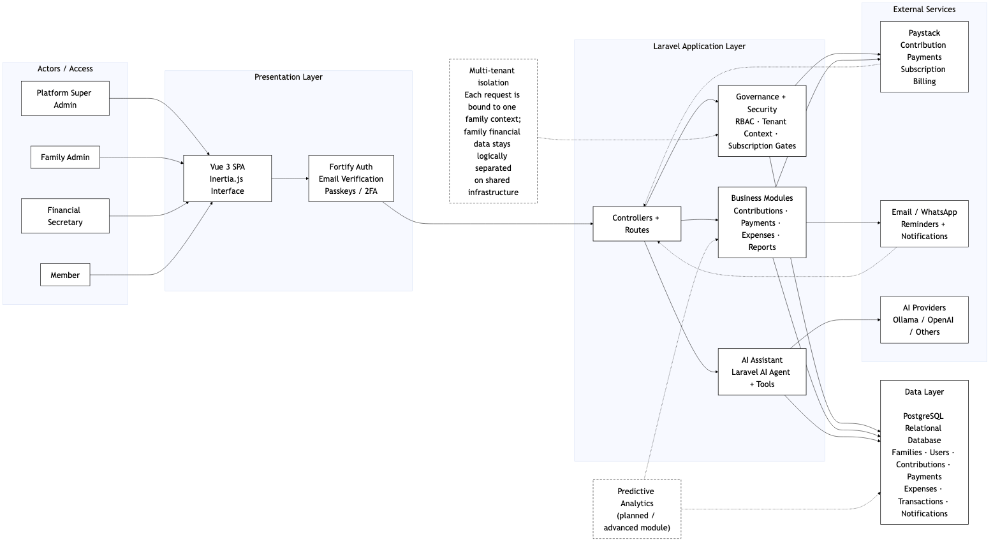
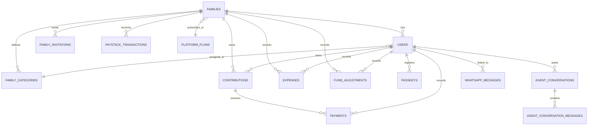
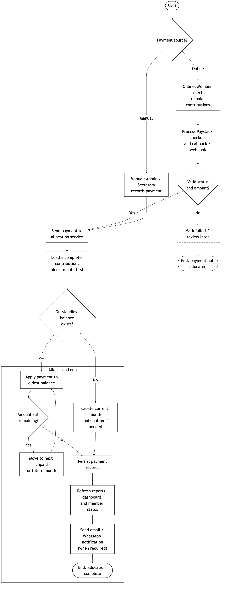
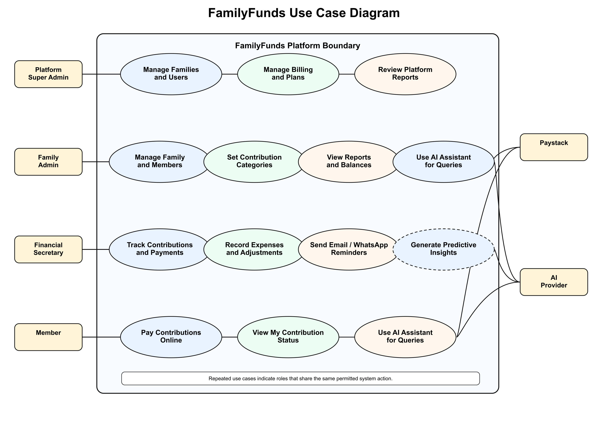

# CHAPTER THREE

## METHODOLOGY

### 3.1 Introduction

This chapter explains the method used to move FamilyFunds from a research problem into a buildable system. The project did not begin with an abstract software idea. It began with a familiar situation in many families: one person keeps contribution records in a notebook or spreadsheet, another member sends a bank-transfer screenshot, someone else pays only part of the monthly amount, and the financial secretary is expected to remember how all of it fits together. Chapter Two established that this type of informal family contribution fund remains important in Nigeria, but existing digital tools rarely address its governance, payment-allocation, and reporting needs. The methodology in this chapter shows how those observations were converted into requirements, design decisions, implementation choices, and evaluation plans.

The methodology combines system design, iterative software development, database modelling, process modelling, interface design, security planning, and evaluation. It is deliberately practical because the proposed system has to be usable by people with different responsibilities. A family administrator may care about categories and invitations; a financial secretary may care about recording payments quickly; a member may only want to know whether last month's payment was credited correctly. Since the records involve money and family trust, the design gives particular attention to tenant isolation, role-based access control, payment accuracy, auditability, and reports that can be understood without accounting knowledge.

The chapter follows the twelve-part structure supplied for the methodology chapter. It starts with an overview of the proposed system and the development approach adopted. It then presents the functional and non-functional requirements, explains the architecture, and describes the data, process, and interface designs. The later sections discuss modelling tools, implementation technologies, testing and validation, deployment, evaluation metrics, and a summary of the chapter.

### 3.2 System Overview

FamilyFunds is a web-based platform for managing family contribution funds. Its immediate purpose is to replace scattered manual records with a single controlled record of contributions, payments, expenses, reminders, and reports. In the manual setting, a financial secretary may know the story behind a payment, but other members may only see fragments of that story in WhatsApp messages or bank alerts. The system is designed to reduce that dependence on memory and private record-keeping by giving each authorised user the right level of visibility.

The system is organised as a multi-tenant platform. Each family has its own workspace, and the data belonging to that family is separated from the data of other families on the same application. Within the workspace, permissions are divided according to role. The Family Administrator manages settings, members, contribution categories, invitations, and subscriptions. The Financial Secretary handles day-to-day financial operations such as payment entry, expenses, adjustments, reminders, and reports. Members mainly view their own contribution status, make online payments where available, and receive notifications.

Contribution tracking is the centre of the design. FamilyFunds generates monthly obligations according to each member's category. This matters because family contribution rules are not always flat. A working adult, a student, and an unemployed member may not be expected to pay the same amount. The system therefore supports contribution categories with different monthly values. When a member pays partly, late, or in advance, the payment is not left for the financial secretary to interpret manually. It is allocated to the oldest outstanding balance first, so the history of what has been settled remains clear.

Other modules support Paystack payments, manual entry for cash or bank transfers, expense recording, fund adjustments, reminders, subscription management, and account-security features such as email verification, two-factor authentication, and WebAuthn passkeys. The AI-enhanced layer is added cautiously. Its role is not to replace the financial secretary, but to assist with plain-language questions, report summaries, and proposed predictive analytics where enough payment history exists. In this way, the proposed system responds directly to the gap identified in Chapter Two: existing tools do not combine family-fund governance, transparent allocation, and intelligent reporting in one platform.

The major features of FamilyFunds are summarised in Table 3.1.

*Table 3.1: Summary of Proposed System Features*

| Feature Area | Description |
| --- | --- |
| Multi-tenant family management | Each family works in its own protected workspace, even though all families use the same application. |
| Role-based access control | Administrators, Financial Secretaries, Members, and Platform Super Admins receive permissions that match their responsibilities. |
| Contribution tracking | Monthly obligations are created from the member's assigned contribution category. |
| Payment allocation | Partial and lump-sum payments are credited against the oldest unpaid balances before newer months. |
| Online payments | Members can pay through Paystack, while authorised officers can still record cash or bank-transfer payments. |
| Expenses and adjustments | Expenses, donations, corrections, and other non-contribution movements are recorded as part of the fund history. |
| Notifications and reminders | Email and WhatsApp reminders support follow-up without relying only on informal group messages. |
| Reports | Monthly and annual reports show collections, payments, expenses, balances, and member status. |
| AI assistance and reporting | The assistant helps users ask permitted questions and supports plain-language report summaries. |
| Predictive analytics | The proposed analytics module uses payment history to estimate default risk where enough data exists. |
| Security | Verification, password hashing, two-factor authentication, passkeys, signed invitations, and tenant scoping protect accounts and records. |
| Subscription management | Families can use platform plans with defined member limits and feature access. |

### 3.3 Research/Development Approach

The development approach adopted for this project is an Agile and iterative Software Development Life Cycle (SDLC). Agile development is suitable where requirements need to be refined through feedback and repeated review, especially when functional requirements and quality requirements are expected to influence each other during development (Masood et al., 2020; Karhapää et al., 2021). FamilyFunds fits this pattern because the requirements are drawn from real family-fund behaviour. Members pay late, some pay in parts, contribution categories differ, older members may prefer bank transfer or cash, and the family still expects records that everyone can trust.

A strict Waterfall model was not selected because it would treat the requirements as fixed from the beginning. In this project, many details are better understood while designing and testing the modules. For example, a contribution category is not just a database value; it affects monthly generation, member dashboards, payment balances, and reports. The same is true for reminders, invitations, subscriptions, and AI-assisted summaries. An iterative approach allows these relationships to be tested and refined module by module.

The Agile/Iterative approach used in this project follows five broad phases:

1. **Requirement identification.** The problem was studied through observation of manual family contribution practices and through the gaps identified in the literature review.
2. **System design.** The architecture, database entities, user roles, payment processes, and security mechanisms were modelled before implementation.
3. **Incremental development.** Modules such as authentication, family management, contributions, payments, expenses, reports, and AI features are developed in manageable iterations.
4. **Testing and validation.** Each major module is checked using unit, integration, feature, and system-level tests.
5. **Evaluation and refinement.** The completed system is evaluated against the project objectives, research questions, and metrics.

This approach also aligns with the Model-View-Controller pattern discussed in Chapter Two. Backend models represent the system data, controllers coordinate requests and business rules, and the Vue/Inertia interface presents the application to users. Because these responsibilities are separated, one part of the system can be revised without requiring the whole application to be rewritten.

### 3.4 System Requirements

System requirements state what FamilyFunds must do and the qualities it must maintain while doing it. For this project, the requirements are not treated as a generic checklist. They are derived from the specific problems of family-fund administration: unclear records, weak role separation, inconsistent payment handling, limited reporting, and the need to keep each family's data separate.

#### 3.4.1 Functional Requirements

Functional requirements describe the behaviours users should be able to see or trigger in the system. They cover the everyday work of the platform: creating a family workspace, inviting members, generating contributions, recording payments, reviewing balances, sending reminders, and preparing reports. They also include proposed AI-related functions because intelligent reporting and prediction form part of the research objectives.

*Table 3.2: Functional Requirements*

| ID | Requirement | Description | Primary Users |
| --- | --- | --- | --- |
| FR-01 | User registration and authentication | Users can register, log in, verify email addresses, reset passwords, and manage secure account access. | All users |
| FR-02 | Family tenant creation | A family can create its own workspace with name, currency, contribution due day, and basic settings. | Family Admin |
| FR-03 | Member invitation | Administrators can invite members through secure tokenised links instead of sharing generic signup instructions. | Family Admin |
| FR-04 | Role management | The family workspace supports Administrator, Financial Secretary, and Member roles. | Family Admin |
| FR-05 | Platform administration | A platform super administrator can review families, users, plans, and platform-wide settings. | Platform Super Admin |
| FR-06 | Contribution category setup | Families can define contribution categories and monthly amounts that match their own rules. | Family Admin |
| FR-07 | Monthly contribution generation | Monthly contribution records are generated for paying members based on category and due date. | Family Admin, Financial Secretary |
| FR-08 | Contribution status tracking | Members and officers can see whether a contribution is unpaid, partially paid, paid, or overdue. | All users |
| FR-09 | Manual payment recording | Authorised officers can enter payments received by cash, transfer, or other offline channels. | Family Admin, Financial Secretary |
| FR-10 | Online payment initiation | Members can start Paystack payments when online payment is enabled for their family plan. | Member |
| FR-11 | Payment allocation | Partial and lump-sum payments are distributed to the oldest outstanding contribution balance first. | System |
| FR-12 | Payment history | The platform keeps dates, amounts, payment channels, and the user who recorded each transaction. | All authorised users |
| FR-13 | Expense recording | Authorised users can record family expenses with amount, description, date, and recorder details. | Family Admin, Financial Secretary |
| FR-14 | Fund adjustments | Donations, corrections, and other non-contribution inflows can be captured without confusing them with monthly dues. | Family Admin, Financial Secretary |
| FR-15 | Reports | Monthly and annual reports present contributions, payments, expenses, adjustments, and balances. | Family Admin, Financial Secretary |
| FR-16 | Member dashboard | Dashboards show contribution progress, recent payments, overdue members, and fund position. | All users |
| FR-17 | Notifications and reminders | Email and WhatsApp reminders can be sent for unpaid or overdue contributions. | Family Admin, Financial Secretary |
| FR-18 | Subscription management | Families can subscribe to plans with defined feature access and member-count limits. | Family Admin |
| FR-19 | AI assistant | The assistant can answer family-fund questions and perform permitted actions only after confirmation. | All users, according to role |
| FR-20 | AI report summary | Financial reports can be summarised in plain language for users without accounting knowledge. | Family Admin, Financial Secretary |
| FR-21 | Predictive analytics | Historical contribution and payment records can be used to propose payment-behaviour predictions. | Family Admin, Financial Secretary |
| FR-22 | Audit-friendly record keeping | Financial records are retained in a structure that supports review, reconciliation, and accountability. | All authorised users |

#### 3.4.2 Non-Functional Requirements

Non-functional requirements describe the qualities that must be present while the features are running. In FamilyFunds, these qualities are especially important because the application stores money-related records and personal details. A feature may appear to work, but it is not acceptable if it exposes another family's records, calculates balances inconsistently, or becomes difficult to use on a mobile phone. Recent Agile requirements research stresses that quality requirements such as performance, security, reliability, and maintainability should influence design choices from the beginning rather than being added at the end (Karhapää et al., 2021).

*Table 3.3: Non-Functional Requirements*

| Category | Requirement | Description |
| --- | --- | --- |
| Performance | Responsive dashboard and reports | Dashboard, contribution, and report pages should remain fast for ordinary family sizes. |
| Performance | Efficient queries | Data access should be scoped by family and written to avoid loading unrelated tenant records. |
| Security | Tenant isolation | A user from one family must not access another family's members, contributions, payments, expenses, or reports. |
| Security | Strong authentication | Password hashing, email verification, two-factor authentication, and passkeys should protect user accounts. |
| Security | Role enforcement | Sensitive actions such as recording payments or changing family settings must be limited to authorised roles. |
| Security | Safe external integrations | Paystack and AI integrations should depend on secure environment configuration, validated callbacks, and controlled data exposure. |
| Usability | Clear navigation | Common actions such as payments, contributions, reports, members, and settings should be easy to locate. |
| Usability | Plain-language reporting | Reports and AI summaries should be understandable to users without accounting or software backgrounds. |
| Usability | Mobile responsiveness | The interface should work on common phone and desktop browsers because many family members use smartphones. |
| Reliability | Accurate payment allocation | Payment allocation must follow the oldest-balance-first rule in a predictable way. |
| Reliability | Scheduled tasks | Contribution generation and reminder jobs should run consistently at configured times. |
| Reliability | Recovery from failed services | Failed callbacks, email delivery problems, or AI provider errors should not corrupt financial records. |
| Maintainability | Modular design | Authentication, tenancy, contributions, payments, reports, and AI features should remain separated in the codebase. |
| Maintainability | Test coverage | Critical behaviours such as tenant isolation, payment allocation, and role permissions should be covered by automated tests. |
| Scalability | Multi-family support | The architecture should support many independent families on shared infrastructure through logical data isolation. |

### 3.5 System Architecture

FamilyFunds uses a web-based client-server architecture with a Laravel backend, Vue.js frontend, Inertia.js server-client bridge, PostgreSQL relational database, and external service integrations. The system is designed as a modular monolith rather than a collection of microservices. This decision suits the size and purpose of the project. Contributions, payments, reports, subscriptions, and AI tools need to be separated clearly in the codebase, but they do not require the deployment and communication overhead of a distributed architecture. A modular monolith also makes it easier to demonstrate the complete system as one coherent application.

The architecture is organised into five main layers:

1. **Presentation layer.** Users interact with a Vue 3 interface that is connected to Laravel routes through Inertia.js.
2. **Authentication and access layer.** Laravel Fortify, role checks, policies, middleware, two-factor authentication, and WebAuthn passkeys manage identity and permissions.
3. **Application/business layer.** Controllers, services, jobs, commands, and AI tools coordinate contributions, payments, expenses, reports, notifications, subscriptions, and assistant interactions.
4. **Data layer.** PostgreSQL stores family, user, contribution, payment, expense, notification, subscription, passkey, WhatsApp, and AI conversation data.
5. **External service layer.** Paystack processes payments and subscriptions, communication channels handle reminders, and AI providers support assistant and report-summary features.

Figure 3.1 shows the proposed high-level architecture.



The architecture uses shared-schema multi-tenancy. In practical terms, different families share one application instance and one PostgreSQL database, but tenant-specific records carry a `family_id` where appropriate. Middleware, policies, and query scoping enforce the rule that a user can only work inside the family to which the user belongs. Recent work on multi-tenant cloud and SaaS systems continues to identify isolation, resource sharing, and tenant-specific quality requirements as central architectural concerns (Jia et al., 2021; Sharma & Kaur, 2021). This design gives FamilyFunds the cost and maintenance advantages of SaaS while still respecting the trust boundary between families.

### 3.6 System Design

System design explains how the proposed system is organised internally. In this project, the design is discussed under three practical concerns: how the data is stored, how the main processes work, and how users interact with the system.

#### 3.6.1 Data Design

The database design starts from the family tenant. The `families` table represents each independent family group on the platform, and most financial records are linked either directly or indirectly to that family. This is the foundation for tenant isolation. If a contribution, payment, expense, invitation, or adjustment belongs to a family, reports can be generated without mixing one family's financial history with another's.

The main entities are described in Table 3.4.

*Table 3.4: Major Database Entities*

| Entity | Purpose | Key Relationships |
| --- | --- | --- |
| `families` | Holds the family tenant record, settings, due day, currency, bank details, suspension status, and subscription information. | Has many users, categories, contributions, expenses, adjustments, invitations, and transactions. |
| `users` | Holds platform users, family membership, role, contribution category, authentication details, and optional super-admin status. | Belongs to a family and may belong to a family category. |
| `family_categories` | Defines a family's contribution tiers and monthly amounts. | Belongs to a family and may be assigned to users. |
| `family_invitations` | Keeps pending invitations, roles, tokens, expiry dates, and acceptance status. | Belongs to a family and inviter user. |
| `contributions` | Represents monthly contribution obligations for members. | Belongs to a family and user; has many payments. |
| `payments` | Records money applied to specific contribution obligations. | Belongs to a contribution and has a recorded-by user. |
| `expenses` | Captures family expenses and the person who recorded them. | Belongs to a family and recorded-by user. |
| `fund_adjustments` | Captures donations, corrections, and other non-contribution balance changes. | Belongs to a family and recorded-by user. |
| `paystack_transactions` | Keeps online payment and subscription transaction records. | Belongs to a user and family. |
| `platform_plans` | Defines subscription plans, prices, member limits, Paystack plan codes, and feature sets. | Used by families for subscription management. |
| `passkeys` | Keeps WebAuthn credential information for passkey authentication. | Belongs to a user. |
| `notifications` | Holds system notifications sent to users. | Polymorphic relationship to notifiable users. |
| `whatsapp_messages` | Records inbound and outbound WhatsApp communication. | Linked to family and user where applicable. |
| `agent_conversations` | Represents AI assistant conversation sessions. | Belongs to a user. |
| `agent_conversation_messages` | Stores AI conversation messages, tool calls, tool results, and metadata. | Belongs to an AI conversation and user. |

Figure 3.2 represents the database design at a high level. The implemented schema uses relational constraints and foreign keys where appropriate, while application-level rules enforce role and tenant boundaries.



*Figure 3.2: Entity-Relationship Diagram*

The main database principle is traceability. A contribution belongs to a family and a member. A payment belongs to a contribution. An expense or adjustment belongs to a family and records who entered it. This makes it possible to reconstruct a member's balance later, not just display a current total. It also supports accountability because important records can be tied back to the authorised user who created them.

#### 3.6.2 Process Design

The system contains several important processes: contribution generation, payment allocation, online payment handling, invitation acceptance, reminder delivery, report generation, and AI-assisted querying. Payment allocation receives special attention because it is the point where a real amount of money becomes a record against one or more contribution months.

The allocation algorithm follows an oldest-balance-first rule, similar to a First-In, First-Out queue. The earliest unpaid contribution is settled before newer ones. This is a fairness decision as much as a technical decision. If a member owes January, February, and March, a payment received in March should not be credited to March while January remains unresolved. FamilyFunds applies the rule consistently so that members and officers are not left to debate which month a payment was meant to cover.

The payment allocation process is shown in Figure 3.3.



The algorithm can be expressed as follows:

```text
Input: member, payment amount, payment date, recorder

1. Retrieve all incomplete contributions for the member.
2. Sort contributions by year and month from oldest to newest.
3. Set remaining amount to the payment amount.
4. For each contribution:
      a. If remaining amount is zero, stop.
      b. Calculate the outstanding balance for the contribution.
      c. Apply the smaller of remaining amount and outstanding balance.
      d. Create a payment record for the amount applied.
      e. Reduce remaining amount.
5. If money remains after all existing balances are cleared:
      a. Create future monthly contribution records where needed.
      b. Apply the remaining amount month by month.
6. Update dashboards, reports, and notifications.
Output: one or more payment records linked to contribution records.
```

Other important processes are summarised below:

- **Contribution generation:** At the start of a month, the application creates contribution records for active paying members using their category and the family's due day.
- **Online payment flow:** A member initiates payment, Paystack handles checkout, the callback or webhook verifies the transaction, and the verified amount is passed to the allocation service.
- **Invitation flow:** An administrator sends an invitation, the invited user receives a tokenised link, the user accepts before expiry, and the account joins the family with the assigned role.
- **Reminder flow:** The application identifies unpaid or partially paid contributions and sends reminders through configured email or WhatsApp channels.
- **Report flow:** Contribution, payment, expense, and adjustment records are aggregated into monthly or annual summaries.
- **AI assistant flow:** The user asks a question, the assistant checks role and family context, calls only permitted tools, and returns an answer grounded in available family data.

#### 3.6.3 Interface Design

The interface is designed as a responsive single-page web application. The expected users are not all the same. Some may be comfortable managing settings and reports, while others may only want to confirm a balance on a phone. Recent responsive interface research emphasises consistency across screen sizes because users move between phones, tablets, and computers when accessing the same system (Li et al., 2022). For this reason, the interface hides database complexity and presents financial information through dashboards, lists, forms, status badges, and plain-language summaries.

The major screens include:

- **Welcome and authentication screens:** Registration, login, password reset, email verification, two-factor challenge, and invitation acceptance.
- **Dashboard:** A summary of contribution progress, recent payments, overdue members, and family fund position.
- **Members module:** Member listing, member creation, member profile, role/category assignment, and member editing.
- **Contributions module:** Contribution list, member contribution details, personal contribution view, and contribution generation.
- **Payments module:** Manual payment recording, payment history, and member self-payment through Paystack.
- **Expenses and fund adjustments:** Forms and lists for outgoing expenses, donations, corrections, and other fund movements.
- **Reports module:** Monthly and annual reports showing financial summaries, contribution status, and balances.
- **Family settings:** Family details, contribution categories, bank details, invitation management, and subscription settings.
- **Platform administration:** Platform-level dashboard, user management, family management, plans, and feature flags.
- **Security settings:** Profile management, password update, two-factor authentication, passkey registration, and WhatsApp verification.
- **AI assistant:** A chat-based interface for asking questions about the family's fund and generating role-permitted insights.

The interface is also designed around role relevance. A Member should not be surrounded by administrative controls. A Financial Secretary needs quick access to payments, expenses, reports, and reminders. A Family Administrator needs member management, categories, subscription settings, and overall visibility. This role-sensitive interface is both a usability decision and a security decision, because users see the functions that match their responsibility.

### 3.7 Modeling Tools

Modelling tools are used to make the proposed system easier to understand before and during implementation. They are useful in this project because the system has several actors and several financial flows. A use-case view shows what each user can do, an architecture diagram shows how the system is layered, and process diagrams show how sensitive operations such as payment allocation are expected to behave.

The following modelling tools are used in this project:

- **Use Case Diagram:** Identifies the actors and the major actions available to each actor.
- **System Architecture Diagram:** Shows the layers of the application and the relationship between users, application components, the database, and external services.
- **Entity-Relationship Diagram:** Represents the major database entities and their relationships.
- **Activity/Flowchart Diagram:** Presents the steps in the payment allocation process.
- **Class-style Model Description:** Explains how major domain objects such as Family, User, Contribution, Payment, Expense, FundAdjustment, PlatformPlan, and Passkey relate to one another.
- **Sequence-style Process Description:** Describes the order of interactions in processes such as online payment, invitation acceptance, and AI assistant queries.

Figure 3.4 presents the use-case view of the proposed system.



The use-case model identifies four main human actors: Platform Super Admin, Family Admin, Financial Secretary, and Member. It also includes external actors such as Paystack and AI providers. This separation is important because external services support the system but do not control it. Paystack processes transactions but does not manage family records. The AI provider receives controlled prompts or tool outputs for specific assistant functions, but the Laravel application remains the authority for permissions, data, and financial records.

### 3.8 Implementation Details

The proposed system is implemented with a Laravel and Vue technology stack. The stack was selected because it allows the project to keep most business logic in Laravel while still presenting a modern single-page user interface through Vue and Inertia. This is useful for a final-year system because the application remains manageable while still supporting dashboards, forms, reports, and interactive payment flows.

*Table 3.5: Implementation Technologies*

| Category | Technology | Purpose |
| --- | --- | --- |
| Programming language | PHP 8.4 | Main backend language for the Laravel application. |
| Backend framework | Laravel 13 | Routing, controllers, models, queues, scheduler, validation, policies, and services. |
| Frontend framework | Vue.js 3 | Interactive pages, forms, dashboards, and reusable interface components. |
| Server-client bridge | Inertia.js 3 | Connects Laravel routes to Vue pages without forcing a separate API layer. |
| Database | PostgreSQL | Relational storage for families, users, contributions, payments, expenses, subscriptions, and AI records. |
| Styling | Tailwind CSS 4 | Responsive interface styling and consistent spacing. |
| Authentication | Laravel Fortify | Login, registration, password reset, email verification, and two-factor authentication support. |
| Passwordless authentication | WebAuthn/passkeys | Device-based authentication using public-key credentials. |
| Payment gateway | Paystack | Online contribution payments and subscription billing. |
| AI integration | Laravel AI SDK | Assistant responses, tool calling, conversation memory, and provider integration. |
| Feature flags | Laravel Pennant | Controlled release of advanced features such as AI assistance. |
| Testing | Pest PHP | Unit, feature, and system-oriented automated tests. |
| Build tool | Vite | Frontend asset compilation and development server. |
| Version control | Git | Source code tracking and collaboration. |
| Code quality | Laravel Pint, ESLint, Prettier | Formatting and style consistency across PHP and frontend files. |
| Development environment | Composer, Node.js, npm | Dependency management and local development support. |

Laravel is used for the backend because it already provides the pieces needed for this type of application: routing, Eloquent ORM, validation, queues, scheduled tasks, policies, notifications, and authentication support. Vue.js is used on the frontend because it supports reactive interfaces and component-based development. Inertia.js connects both layers without requiring a separate REST API, which keeps the project manageable for a single-developer final-year project while still giving users the feel of a single-page application (Reinink, 2024; You, 2024).

Paystack is selected because it is widely used for payment processing in Nigeria and supports the Naira-based payment context required by the project (Paystack, 2024). Laravel Fortify provides the authentication foundation, while WebAuthn and two-factor authentication strengthen account protection. Recent FIDO2 usability research shows why passwordless authentication is promising but still needs fallbacks for users who may not understand or support passkeys on every device (Lyastani et al., 2020; W3C, 2021). The Laravel AI SDK is used so that AI provider access and tool-based assistant functions can remain under the application's permission system instead of being treated as a separate uncontrolled service.

### 3.9 System Testing and Validation

Testing and validation are necessary because FamilyFunds handles records that people may later use to settle disputes or confirm financial responsibility. A small error in allocation can make a member appear to owe money that has already been paid. A weak tenant boundary can expose another family's private records. For that reason, testing is planned at several levels rather than only at the end of development. AI features require extra validation because recent studies show that LLMs can produce fluent answers that are still factually wrong or logically weak, especially in financial contexts (de Wynter et al., 2023; Kang & Liu, 2023).

*Table 3.6: Testing and Validation Plan*

| Test Type | What Will Be Tested | Expected Result |
| --- | --- | --- |
| Unit testing | Payment allocation, contribution status calculation, role helper methods, and amount formatting. | Each unit returns correct values for normal and edge cases. |
| Feature testing | Member creation, contribution generation, payment recording, and report viewing. | Users complete permitted workflows successfully. |
| Integration testing | Paystack callbacks, payment allocation, notifications, and reports working together. | Data moves between modules without duplication or corruption. |
| Tenant-isolation testing | Attempts by one family user to open another family's records. | Access is denied and no cross-family data is exposed. |
| Role-permission testing | Actions performed by Admin, Financial Secretary, Member, and Platform Super Admin roles. | Sensitive actions are available only to authorised roles. |
| Payment-allocation testing | Partial payments, overpayments, lump-sum payments, and future-month payments. | Payments follow the oldest-balance-first rule in every tested scenario. |
| Security testing | Login, email verification, two-factor authentication, passkeys, invitation tokens, throttling, and webhook validation. | Invalid or unauthorised requests are rejected. |
| AI-response validation | Assistant answers, report summaries, tool calls, and confirmation-before-write behaviour. | AI output is relevant, role-aware, and grounded in available family data. |
| Usability validation | Navigation, forms, mobile layout, dashboards, and report readability. | Users complete key tasks with minimal confusion. |
| System testing | Full user journeys from registration to family setup, contribution generation, payment, reports, and reminders. | The system works as a complete application, not as disconnected modules. |

The most important validation scenarios are:

1. A member can view only personal contribution records.
2. A Financial Secretary can record payments and expenses but cannot change family ownership or platform settings.
3. An Administrator can manage family members, categories, invitations, and reports.
4. A payment made for a member with multiple unpaid months is allocated to the oldest unpaid month first.
5. A Paystack transaction is not recorded as a successful payment unless the transaction is verified.
6. A user from Family A cannot access records from Family B.
7. A report total equals the sum of payments, expenses, and adjustments stored in the database.
8. AI assistant responses respect the user's role and do not expose unauthorised member information.

The automated test suite will be run using Pest PHP. For demonstration, the most important acceptance condition is not simply that the interface loads. The critical behaviours must pass: authentication, tenant isolation, role permissions, payment allocation, and financial-report calculations.

### 3.10 Deployment Strategy

The system is designed for both local development and web or cloud deployment. During development, the application runs on a local machine using PHP, Composer, Node.js, npm, PostgreSQL, and a local web server. For production use, the same application can be deployed to a cloud-hosted Linux server or to a managed Laravel hosting environment.

The local development requirements are:

- PHP 8.4 or later.
- Composer for PHP dependency management.
- Node.js and npm for frontend dependencies and Vite builds.
- PostgreSQL database server.
- Laravel `.env` configuration file.
- Paystack test credentials for payment flows.
- AI provider configuration for assistant and report features.
- Mail and WhatsApp configuration for notifications where applicable.
- Queue worker and scheduler support for background jobs and scheduled reminders.

The production deployment requirements are:

- HTTPS-enabled domain name.
- Web server such as Nginx or Apache.
- PHP 8.4 runtime with required extensions.
- PostgreSQL database with regular backups.
- Queue worker process for jobs.
- Laravel scheduler configured to run scheduled commands.
- Secure environment variables for database, mail, Paystack, AI provider, and WhatsApp credentials.
- Proper file permissions for Laravel storage and cache directories.
- Monitoring of logs, failed jobs, payment callbacks, and scheduled tasks.

The recommended deployment flow is:

1. Prepare the production server and database.
2. Upload or pull the application source code from version control.
3. Install Composer dependencies.
4. Install Node dependencies and build frontend assets.
5. Configure the `.env` file with production credentials.
6. Run database migrations.
7. Cache configuration, routes, and views.
8. Start queue workers and configure the scheduler.
9. Configure HTTPS and web server routing to Laravel's public directory.
10. Perform post-deployment smoke tests for login, dashboard, contribution generation, payment initiation, reports, and reminders.

Because the system manages money-related data, deployment must prioritise secure configuration. Development credentials must not be reused in production. Paystack webhooks should point to the production callback URL, and external service credentials should remain in environment variables rather than in source code. Backups are also important because contribution and payment history must not depend only on the current running server.

### 3.11 Evaluation Metrics

Evaluation metrics define how the success of the project will be measured. FamilyFunds contains ordinary software modules, such as authentication and payment recording, as well as AI and data-related features. The evaluation therefore cannot depend on one measure alone. It must consider functional correctness, tenant security, usability, performance, report accuracy, and the usefulness of AI-supported outputs.

*Table 3.7: Evaluation Metrics*

| Metric | What It Measures | Target/Expected Outcome |
| --- | --- | --- |
| Requirement coverage | Whether the implemented system satisfies the functional requirements in Section 3.4.1. | Core requirements are implemented or clearly identified as planned advanced features. |
| Test pass rate | Percentage of automated tests that pass. | Critical authentication, tenant, payment, and report tests pass. |
| Payment allocation correctness | Whether payments are credited to the correct contribution periods. | All tested allocation scenarios produce the expected balances. |
| Tenant isolation success | Whether users can access only their own family data. | No cross-family access occurs in tested scenarios. |
| Role-permission accuracy | Whether each role performs only permitted actions. | Admin, Financial Secretary, Member, and Super Admin permissions match the specification. |
| Report accuracy | Whether report totals match database records. | Report totals equal stored payments, expenses, and adjustments. |
| Response time | Time taken for dashboard loading, report generation, and payment recording. | Common operations respond within an acceptable time for ordinary family sizes. |
| AI response relevance | Whether assistant answers stay within family fund management and available system data. | Responses remain within scope and use permitted data. |
| AI report usefulness | Whether generated summaries are understandable to non-expert family members. | Summaries are readable, coherent, and faithful to the supplied financial data. |
| Prediction accuracy | Percentage of correct default or on-time predictions where sufficient historical data exists. | Reported only where enough historical data is available. |
| Precision and recall | Quality of predicted default risk, especially false alarms and missed defaulters. | Precision and recall are reported with accuracy to avoid misleading conclusions. |
| Usability feedback | Whether representative users can complete key tasks without confusion. | Users can view balances, record payments, and read reports without unnecessary help. |

For the predictive analytics module, accuracy alone is not enough. If most members usually pay on time, a model can appear accurate simply by predicting "paid" for everyone. Recent credit-scoring literature continues to identify class imbalance, explainability, and model-risk validation as major concerns in default prediction (Hussin Adam Khatir & Bee, 2022; Robisco & Carbó Martínez, 2022). Precision, recall, and F1-score therefore give a better picture of whether the system is actually identifying likely defaulters. Response time is also considered because an AI-generated report summary may be technically correct but still frustrating if it takes too long to appear.

### 3.12 Summary

This chapter presented the methodology for the proposed FamilyFunds system. It explained how the system is designed as a secure, AI-enhanced, multi-tenant platform for managing family contributions, payments, expenses, reports, subscriptions, reminders, and member access.

The chapter justified the Agile/Iterative development approach because the requirements are practical and likely to be refined through feedback. It presented the functional and non-functional requirements, explained the system architecture, and described the database, process, and interface design. It also identified the modelling tools, listed the implementation technologies, and outlined the testing, deployment, and evaluation strategies.

The next chapter moves from methodology to implementation. It will describe how the design was built in the application, how the modules were integrated, and how testing results show whether the system satisfies the objectives stated in Chapter One.

---

> **References:** All citations in this chapter are listed in the centralized [References](references.md) file.
