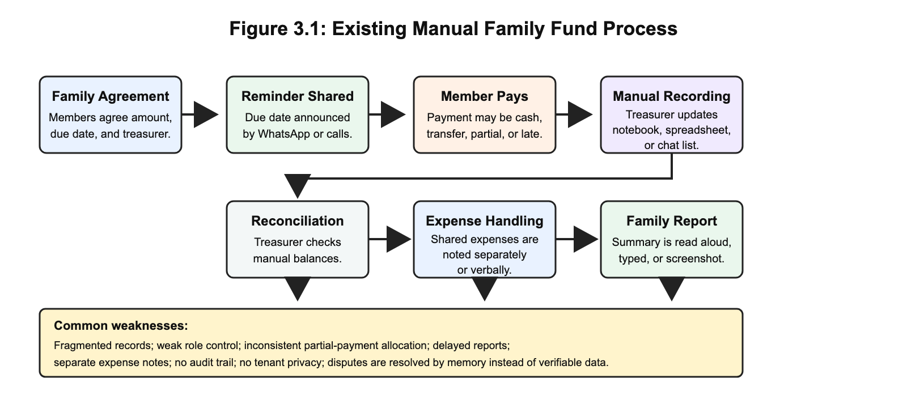
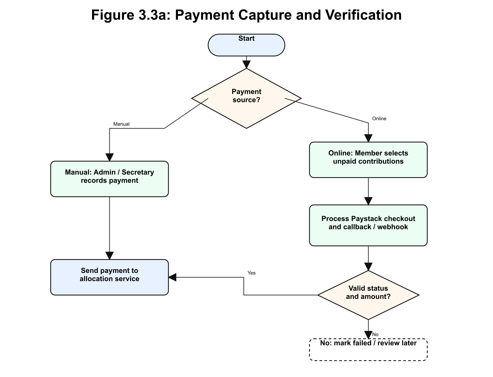
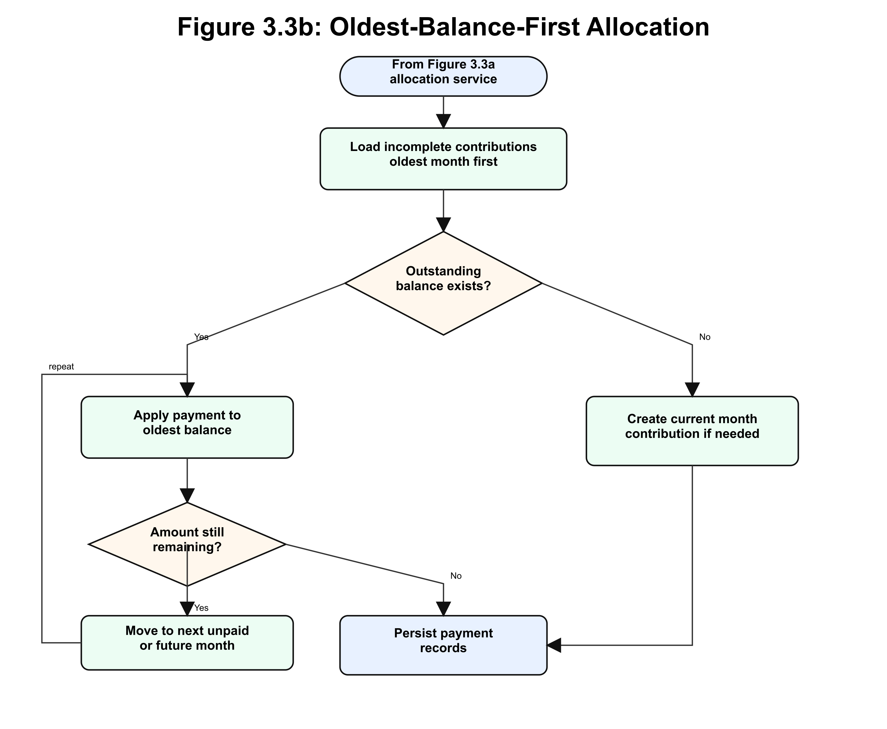
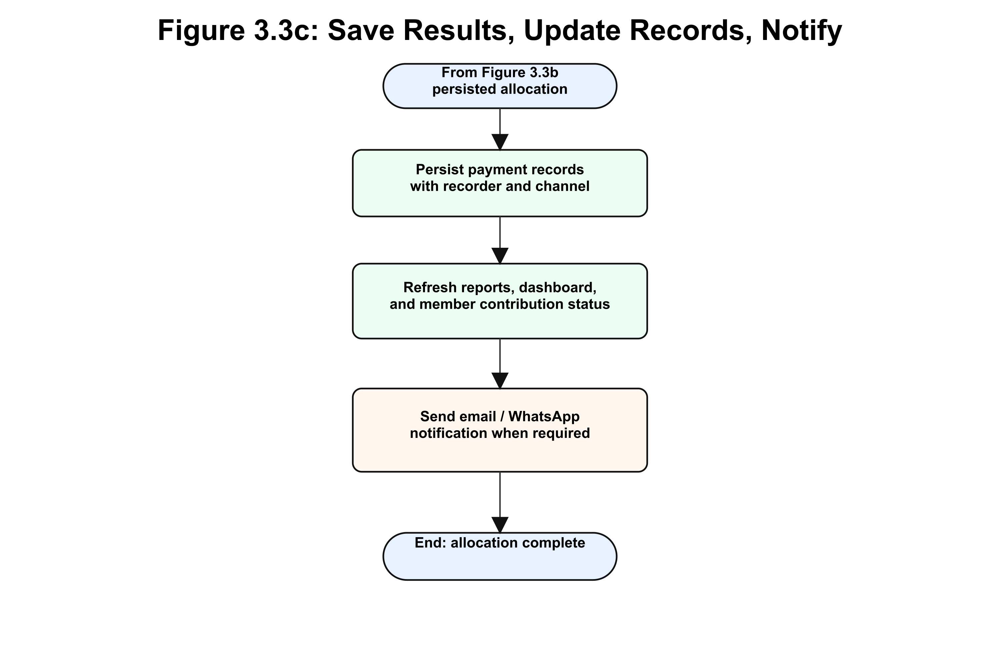
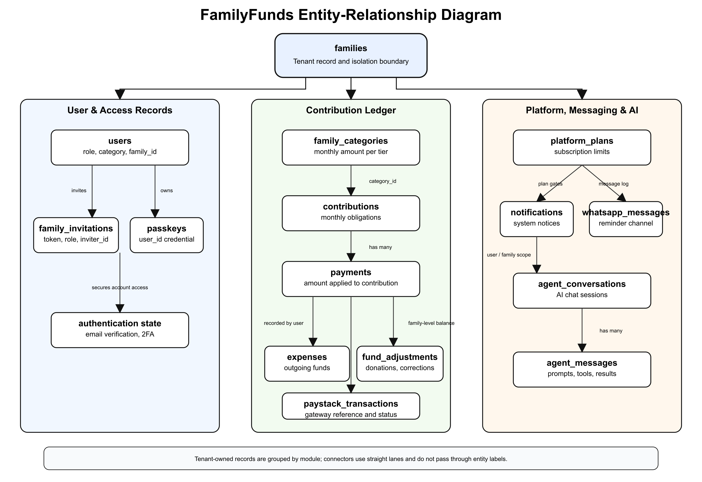

# CHAPTER THREE

## METHODOLOGY

### 3.1 Introduction to the Chapter

This chapter explains the methodology used to design and develop FamilyFunds. The aim stated in Chapter One is to build an AI-enhanced multi-tenant web application for managing family contribution funds with secure access, contribution tracking, payment allocation, expense recording, reminders, and reporting. The objectives require both academic investigation and practical system development: review related work, design the system, implement the major modules, integrate controlled AI assistance, define the predictive analytics pathway, and test the system against functional and quality requirements.

The chapter therefore covers the project approach, existing-system analysis, proposed-system overview, requirements, data collection, population and sampling considerations, architecture, UML and system diagrams, database design, algorithm and model design, tools and technologies, and ethical considerations. Each methodological choice is linked to the problem: family funds need reliable records, clear responsibilities, private family workspaces, accurate payment handling, and reports that members can understand.

### 3.2 Research Design / Project Approach

The study uses an applied system-development design. The output of the research is a working software artefact rather than only a survey or theoretical model. This approach is suitable because the central problem is practical: families need a better way to manage contribution funds than notebooks, spreadsheets, and scattered messages. The system is therefore designed, implemented, and validated as a response to identified requirements.

The software development approach is Agile and iterative. A strict Waterfall model was not selected because family fund requirements are likely to become clearer during design and implementation. A simple feature such as payment recording affects member balances, reports, reminders, AI summaries, and audit trails. If the system were designed once and frozen too early, important realities of the domain would be missed. Agile development supports incremental delivery, review, and correction while still keeping the work tied to the objectives of the study (Karhapää et al., 2021; Schwaber & Sutherland, 2020).

The work followed five broad stages:

1. Problem and literature analysis, covering informal finance, existing platforms, multi-tenancy, RBAC, digital payments, AI reporting, and predictive analytics.
2. Requirements identification, based on the problems observed in manual family fund administration and the gaps established in Chapter Two.
3. System design, including architecture, data design, user roles, process flows, interface structure, payment allocation, and security controls.
4. Incremental implementation, where authentication, family management, contributions, payments, expenses, reports, reminders, subscriptions, and AI features were developed in modules.
5. Validation planning, where the critical behaviours were mapped to tests and acceptance checks, especially tenant isolation, role enforcement, payment allocation, report accuracy, and AI response control.

This approach allows the project to remain honest about its scope. AI assistant and report-summary features are treated as implemented system features where supported by the application. Predictive analytics is treated as planned and evaluation-dependent because meaningful prediction requires sufficient historical contribution data.

### 3.3 Analysis of Existing System

The existing system is the manual or semi-digital method commonly used by families to manage contribution funds. In this arrangement, a family appoints a treasurer or financial secretary. Members send contributions through cash, bank transfer, or informal handover. The financial secretary records payments in a notebook, a spreadsheet, a phone note, or a WhatsApp message thread. Reports are given verbally, posted as text summaries, or shared as screenshots.

This existing process has several weaknesses. First, records are fragmented. A payment may exist in a bank alert, a WhatsApp screenshot, and a handwritten note, but those pieces may not agree. Second, roles are informal. A family may know who the financial secretary is, but the tools being used do not technically prevent other people from editing a spreadsheet or forwarding wrong information. Third, partial and lump-sum payments are difficult to allocate consistently. Fourth, expense records are often separate from contribution records, making it hard to calculate the true fund balance. Fifth, reporting depends on manual effort, so reports may be delayed, incomplete, or written in a way that ordinary members cannot interpret.

Figure 3.1 summarises the existing manual family fund process.

The major bottleneck in the existing system is that the family record depends too much on one person's manual discipline. Even when the person is honest, the process does not provide enough structure for verification, audit, payment allocation, or tenant-level privacy. These weaknesses justify the need for a purpose-built system.

### 3.4 Proposed System Overview

The proposed system is FamilyFunds, a multi-tenant web application for family contribution fund management. Each family operates in its own workspace, while the platform uses shared infrastructure. Users are assigned roles that determine what they can see and do. The system records members, contribution categories, monthly obligations, payments, expenses, adjustments, reminders, reports, subscription plans, and AI assistant interactions.

FamilyFunds resolves the problems in the existing system by moving the authoritative record into a structured PostgreSQL database. It also introduces role-based access control, Paystack payment support, deterministic oldest-balance-first payment allocation, automated contribution generation, reminders, and clear reports. AI assistance is added as a controlled interface for answering permitted questions and summarising reports in plain language.

*Table 3.1: Summary of Proposed System Features*

| Feature Area | Description |
| --- | --- |
| Multi-tenant family workspaces | Each family has a logically isolated workspace within the same application. |
| Role-based access control | Family Administrator, Financial Secretary, Member, and Platform Super Administrator have separate permissions. |
| Contribution categories | Families define monthly contribution amounts for groups such as employed members, students, or other categories. |
| Monthly contribution generation | The system creates contribution obligations for paying members based on category and due date. |
| Payment recording | Authorised users record offline payments, while members can initiate online payments through Paystack. |
| Payment allocation | Payments are applied to the oldest outstanding balances first. |
| Expenses and adjustments | Family spending, donations, corrections, and other balance movements are recorded. |
| Reminders | Email, browser push, and WhatsApp-related reminder flows support follow-up. |
| Reports | Monthly and annual reports show collections, balances, expenses, and member status. |
| AI assistant and summaries | The assistant answers role-permitted questions and supports plain-language report summaries. |
| Predictive analytics pathway | Historical payment data can later support default-risk indicators when enough data exists. |
| Security controls | Email verification, password hashing, two-factor authentication, passkeys, signed invitations, policies, and tenant scoping protect the system. |

### 3.5 System Requirements

System requirements define what the system must do and the qualities it must maintain while doing so. The requirements below are written to be testable because vague requirements such as "the system should be fast" do not help implementation or validation.

#### 3.5.1 Functional Requirements

*Table 3.2: Functional Requirements*

| ID | Requirement | Description | Main Actor |
| --- | --- | --- | --- |
| FR1 | User authentication | Users shall register, log in, verify email, reset passwords, and manage account security. | All users |
| FR2 | Family workspace creation | A family administrator shall create and configure a family workspace. | Family Admin |
| FR3 | Member invitation | The system shall allow administrators to invite members using secure invitation links. | Family Admin |
| FR4 | Role assignment | The system shall support Family Admin, Financial Secretary, Member, and Platform Super Admin roles. | Family Admin |
| FR5 | Contribution category setup | Administrators shall define contribution categories and monthly amounts. | Family Admin |
| FR6 | Monthly contribution generation | The system shall generate monthly obligations for paying members. | Family Admin, System |
| FR7 | Contribution status tracking | The system shall show unpaid, partially paid, paid, and overdue statuses. | All authorised users |
| FR8 | Manual payment recording | Authorised officers shall record cash, transfer, or offline payments. | Family Admin, Financial Secretary |
| FR9 | Online payment processing | Members shall initiate online payments through Paystack where enabled. | Member |
| FR10 | Payment verification | The system shall verify Paystack transactions before marking them successful. | System |
| FR11 | Payment allocation | The system shall allocate payments to the oldest outstanding contribution balances first. | System |
| FR12 | Expense recording | Authorised users shall record family expenses with amount, date, description, and recorder. | Family Admin, Financial Secretary |
| FR13 | Fund adjustment recording | Authorised users shall record donations, corrections, and other non-contribution balance movements. | Family Admin, Financial Secretary |
| FR14 | Reports | The system shall generate monthly and annual reports for contributions, payments, expenses, adjustments, and balances. | Family Admin, Financial Secretary |
| FR15 | Member dashboard | Members shall view personal balances, payment history, and contribution status. | Member |
| FR16 | Reminders | Authorised users shall send or trigger contribution reminders through supported channels. | Family Admin, Financial Secretary |
| FR17 | Subscription management | Families shall access platform plans with member limits and feature availability. | Family Admin |
| FR18 | AI assistant | The assistant shall answer questions using permitted family data and role-aware tools. | Authorised users |
| FR19 | AI report summary | The system shall support plain-language summaries of financial reports. | Family Admin, Financial Secretary |
| FR20 | Predictive analytics pathway | The system design shall support later prediction of payment behaviour where sufficient history exists. | Family Admin, Financial Secretary |

#### 3.5.2 Non-Functional Requirements

*Table 3.3: Non-Functional Requirements*

| ID | Category | Requirement | Expected Measure |
| --- | --- | --- | --- |
| NFR1 | Security | A user shall access only records belonging to the user's family tenant. | Cross-family access attempts are denied. |
| NFR2 | Security | Sensitive actions shall be restricted by role. | Members cannot record payments or alter family settings. |
| NFR3 | Security | User accounts shall support strong authentication controls. | Email verification, 2FA, passkeys, and password hashing are available. |
| NFR4 | Reliability | Payment allocation shall be deterministic. | The same payment history produces the same balances. |
| NFR5 | Reliability | Paystack callbacks shall not create duplicate successful payments. | Repeated callback events do not double-record payments. |
| NFR6 | Usability | Common workflows shall be usable on mobile and desktop browsers. | Key pages remain responsive and readable. |
| NFR7 | Usability | Reports shall be understandable to non-accounting users. | Summary text and tables use clear labels and plain language. |
| NFR8 | Performance | Dashboard and report pages shall remain responsive for ordinary family sizes. | Common pages load within an acceptable time during testing. |
| NFR9 | Maintainability | Modules shall remain separated by responsibility. | Authentication, payments, reports, and AI logic are not mixed into one layer. |
| NFR10 | Auditability | Financial records shall store relevant dates, amounts, users, and relationships. | Transactions can be reviewed and reconciled. |
| NFR11 | Privacy | AI features shall use only the data needed for the user's request. | Prompts and tool calls avoid unnecessary personal exposure. |
| NFR12 | Availability | The deployed system shall support HTTPS, queues, scheduler, and backups. | Required services are configured in deployment. |

#### 3.5.3 Deployment Requirements

*Table 3.4: Deployment Requirements*

| Requirement Type | Requirement |
| --- | --- |
| Runtime | PHP 8.4 or later with required Laravel extensions |
| Dependency tools | Composer, Node.js, npm, and Vite build process |
| Database | PostgreSQL database with secure credentials and backups |
| Web server | HTTPS-enabled Nginx, Apache, Laravel Cloud, or equivalent platform |
| Background processing | Queue worker and Laravel scheduler for jobs and reminders |
| Environment configuration | `.env` variables for database, mail, Paystack, AI provider, WhatsApp-related settings, and app keys |
| Security | HTTPS, password hashing, signed URLs, webhook validation, and restricted credentials |

### 3.6 Data Collection Methods

This project does not rely on a formal questionnaire or invented survey data. The data used for the methodology came from four honest sources. The first source was literature and document analysis, including studies on informal finance, digital financial inclusion, SaaS multi-tenancy, RBAC, digital payments, AI reporting, and predictive analytics. The second source was observation of typical family fund administration: how members are added, how contribution amounts are agreed, how payments are announced, and how balances are reconciled. The third source was analysis of existing tools such as PiggyVest, Cowrywise, CreditClan, Lendsqr, WhatsApp, and spreadsheets. The fourth source was the system's own development artefacts: routes, controllers, models, migrations, diagrams, requirements, and test scenarios.

For AI and predictive features, the relevant data is system-generated family fund data such as contribution months, due dates, payment dates, payment amounts, outstanding balances, reminder history, and report summaries. No personal data is invented for the study. Where sample data is used for testing or demonstration, it is treated as test data rather than real participant data.

### 3.7 Population and Sampling

The study is mainly a system-development project, so it does not use a statistical population or probability sampling method. The relevant user population for design purposes consists of the people who normally participate in a family contribution fund: family administrators, financial secretaries, ordinary members, and the platform administrator.

Validation scenarios are selected purposively because the aim is to test whether the artefact behaves correctly in the most important use cases. The selected scenarios include creating a family, inviting members, assigning roles, generating contributions, recording partial payments, initiating Paystack payments, viewing dashboards, sending reminders, generating reports, using AI assistance, and preventing cross-family access. This sampling approach is appropriate because correctness is judged by system behaviour under realistic workflows, not by generalising survey responses.

### 3.8 System Architecture / Design

FamilyFunds is designed as a layered, modular monolith. The frontend layer uses Vue.js and Inertia.js to present dashboards, forms, reports, settings, and AI chat screens. The application layer uses Laravel controllers, requests, services, policies, jobs, commands, and AI tools. The data layer uses PostgreSQL to store families, users, contributions, payments, expenses, adjustments, plans, notifications, passkeys, WhatsApp-related messages, and AI conversations. External services include Paystack for payments and subscriptions, mail and messaging channels for communication, and AI providers for assistant functions.

Figure 3.2 shows the high-level architecture.

The architecture uses shared-schema multi-tenancy. Each family-specific record carries a `family_id` where appropriate. Middleware, policies, validation, and query scoping enforce the boundary. This strategy keeps the system practical for many small family groups while still maintaining logical separation. The design also keeps external services outside the authority of the application. Paystack verifies transactions, but Laravel decides how verified payments affect contribution records. The AI provider generates language, but Laravel controls permissions, tools, and data access.

### 3.9 Use Case / UML Diagrams

The system uses UML-style and process diagrams to explain the main actors, workflows, and data relationships. The diagrams are used because the system contains several roles, many related entities, and financial processes that are easier to verify visually than through prose alone.

Figure 3.3 presents the use case diagram.

The main human actors are Platform Super Administrator, Family Administrator, Financial Secretary, and Member. The Platform Super Administrator manages platform-wide oversight. The Family Administrator manages the family workspace, members, settings, contribution categories, subscriptions, and reports. The Financial Secretary records payments, expenses, adjustments, reminders, and reports. Members view their own status and pay contributions. External actors include Paystack and AI providers, but they support rather than control the system.

The payment allocation process is one of the most important workflows because it affects member balances and family trust. Figure 3.4 presents the activity/flowchart view in readable panels.

The class-style model is represented by the main domain entities: Family, User, FamilyCategory, Contribution, Payment, Expense, FundAdjustment, PlatformPlan, PaystackTransaction, Passkey, Notification, WhatsAppMessage, AgentConversation, and AgentConversationMessage. The sequence-style processes include invitation acceptance, contribution generation, manual payment recording, Paystack payment verification, reminder sending, report generation, and AI assistant response generation.

### 3.10 Database Design

The database design uses PostgreSQL as the relational database. The design is centred on the family tenant. Tables that contain family-specific data include a `family_id` field or are connected through another family-owned entity. This supports shared-schema multi-tenancy while keeping relationships clear.

Figure 3.5 shows the entity-relationship diagram.

*Table 3.5: Major Database Entities*

| Entity | Purpose | Key Relationship |
| --- | --- | --- |
| `families` | Stores family workspace settings, currency, due day, status, billing, and bank details. | Has many users, categories, contributions, expenses, adjustments, invitations, and transactions. |
| `users` | Stores account, role, family membership, category, authentication, and profile data. | Belongs to a family and may belong to a family category. |
| `family_categories` | Stores contribution tiers and monthly amounts. | Belongs to a family and may be assigned to users. |
| `family_invitations` | Stores invitation email, role, token, expiry, and acceptance status. | Belongs to a family and inviter. |
| `contributions` | Stores monthly contribution obligations and statuses. | Belongs to a family and user; receives payments. |
| `payments` | Stores payment amounts applied to contribution obligations. | Belongs to a contribution and recorded-by user. |
| `expenses` | Stores family spending records. | Belongs to a family and recorded-by user. |
| `fund_adjustments` | Stores donations, corrections, and non-contribution balance changes. | Belongs to a family and recorded-by user. |
| `paystack_transactions` | Stores online payment and subscription transaction references. | Belongs to a family and user. |
| `platform_plans` | Stores subscription plan names, prices, limits, and features. | Used by families for subscription management. |
| `passkeys` | Stores WebAuthn credential information. | Belongs to a user. |
| `notifications` | Stores application notifications. | Linked to notifiable users. |
| `whatsapp_messages` | Stores inbound and outbound WhatsApp-related communication. | Linked to family and user where applicable. |
| `agent_conversations` | Stores AI assistant conversation sessions. | Belongs to a user. |
| `agent_conversation_messages` | Stores AI messages, tool calls, tool results, and metadata. | Belongs to an AI conversation. |

The database design supports financial traceability by separating obligations from payments. A contribution records what a member owes for a period. A payment records money applied to that obligation. This separation is important because one incoming amount can be split across more than one contribution.

### 3.11 Algorithm / Model Design

The main algorithm in the system is the oldest-balance-first payment allocation algorithm. It handles manual and verified online payments in a consistent way.

*Table 3.6: Oldest-Balance-First Payment Allocation Algorithm*

| Step | Operation |
| --- | --- |
| 1 | Receive the member, payment amount, payment channel, and transaction details. |
| 2 | Retrieve the member's unpaid and partially paid contributions, ordered from oldest to newest. |
| 3 | For each contribution, calculate the outstanding balance. |
| 4 | Apply the available payment amount to the oldest outstanding balance. |
| 5 | Mark the contribution as paid if the balance reaches zero, or partially paid if a balance remains. |
| 6 | Continue until the payment amount is exhausted or all outstanding balances are cleared. |
| 7 | If an overpayment remains, apply it according to the system's advance-payment rules or record it for review. |
| 8 | Store payment records and update contribution statuses for reporting. |

The AI assistant model is designed as a tool-aware assistant. The user's role and family context are checked before tools are used. Read-only questions, such as contribution summaries or fund balances, return information from permitted records. Write-related actions, such as recording expenses or payments through an assistant tool, require explicit confirmation and role permission.

The predictive analytics model is planned as a supervised classification pathway, not as an unconditional feature claim. Possible input features include payment delay, number of unpaid months, contribution category, previous partial payments, reminder count, and historical consistency. Possible output labels include "likely on time" and "likely overdue." The evaluation should use accuracy together with precision, recall, and F1-score because raw accuracy can be misleading when most members usually pay on time (Hussin Adam Khatir & Bee, 2022; Robisco & Carbó Martínez, 2022).

### 3.12 Tools and Technologies

The project uses tools selected for practicality, maintainability, and compatibility with the application requirements.

*Table 3.7: Tools and Technologies*

| Category | Tool/Technology | Purpose |
| --- | --- | --- |
| Backend language | PHP 8.4 | Main server-side language. |
| Backend framework | Laravel 13 | Routing, controllers, validation, queues, scheduler, policies, models, and services. |
| Frontend framework | Vue.js 3 | User interface pages, dashboards, forms, and interactive components. |
| Server-client bridge | Inertia.js 3 | Connects Laravel routes to Vue pages without a separate REST API. |
| Database | PostgreSQL | Relational storage for family, user, contribution, payment, expense, and AI records. |
| Styling | Tailwind CSS 4 | Responsive interface styling. |
| Authentication | Laravel Fortify | Login, registration, password reset, email verification, and two-factor support. |
| Passwordless access | WebAuthn/passkeys | Strong browser-based authentication. |
| Payment gateway | Paystack | Online contribution payments and subscription billing. |
| AI integration | Laravel AI SDK | Assistant responses, tool calling, and provider integration. |
| Feature flags | Laravel Pennant | Controlled release of features such as AI assistance. |
| Testing | Pest PHP | Automated tests for models, features, policies, payments, reports, and AI tools. |
| Build tool | Vite | Frontend asset compilation and development server. |
| Version control | Git | Source tracking and collaboration. |
| Code quality | Laravel Pint, ESLint, Prettier | Formatting and static code quality. |
| Development tools | Composer, Node.js, npm | Dependency management and project tooling. |

Laravel was selected because it provides mature support for routing, validation, queues, scheduled commands, notifications, policies, and Eloquent models. Vue and Inertia were selected because they allow a modern single-page experience without forcing the project to maintain a separate API layer. PostgreSQL was selected as the stated database technology because the project requires reliable relational storage, constraints, and query support. Paystack fits the Nigerian payment context. The Laravel AI SDK keeps assistant features inside the application's own permission and tool structure.

### 3.13 Ethical Considerations

The project handles financial and personal information, so ethical considerations are central to the design. The first concern is privacy. A family member's contribution history, payment status, phone number, email address, and role should not be exposed to another family or to unauthorised members of the same family. Tenant isolation and RBAC are therefore ethical safeguards as well as technical features.

The second concern is consent and transparency. Members should understand that their records are being stored in a digital system for family fund management. If AI summaries or assistant features are used, users should understand that the AI is a support tool and not an independent auditor or financial adviser.

The third concern is data minimisation. The system should collect only data needed for contribution management, payment processing, reminders, reporting, authentication, and authorised AI assistance. AI prompts should avoid sending unnecessary personal data to external providers.

The fourth concern is security. Password hashing, email verification, two-factor authentication, passkeys, signed invitation links, webhook validation, HTTPS deployment, and secure environment variables are required to protect users. The design should also comply with applicable Nigerian data protection expectations, including responsible processing and protection of personal data under the Nigeria Data Protection Act 2023.

The fifth concern is intellectual property. The project uses open-source frameworks and libraries such as Laravel, Vue, Inertia, Tailwind CSS, and Pest according to their licences. External services such as Paystack and AI providers are used through their documented APIs and configuration requirements.

### 3.14 Summary of the Chapter

This chapter described the methodology used for FamilyFunds. It adopted an applied system-development design and an Agile iterative approach because the project solves a practical problem whose requirements become clearer through design and implementation. The chapter analysed the existing manual system, introduced the proposed system, specified functional and non-functional requirements, explained the data collection method, clarified the non-survey sampling approach, and described the architecture, diagrams, database design, algorithms, tools, and ethical considerations.

The methodology shows how the project moves from the literature gap in Chapter Two to a concrete system design. Chapter Four will present how the designed modules were implemented, tested, and validated against the requirements stated in this chapter.

---

> **References:** All citations in this chapter are listed in the centralized [References](references.md) file.
