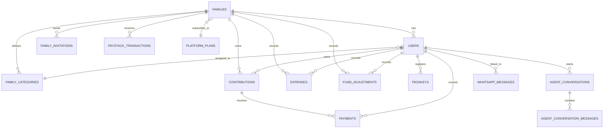

# CHAPTER THREE

## METHODOLOGY

### 3.1 Introduction

This chapter is about turning a real-world headache into something a developer can actually build. The headache is familiar: one relative keeps the contribution book in pencil, another sends a payment screenshot to a WhatsApp group, somebody else pays half the month's amount in cash, and at the end of the year nobody is entirely sure what was paid, what is owed, or what was spent. Chapter Two showed that this kind of family contribution fund is still common in Nigeria, but the digital tools available either ignore groups completely or were built for formal cooperative societies. What follows is the plan for closing that gap: how the problem became a list of requirements, how those requirements shaped the design, and how the design will be tested.

The chapter blends several activities that normally get treated as separate disciplines—system design, iterative development, database modelling, process modelling, interface design, security planning, evaluation. They are stitched together here because the project itself does not really separate them in practice. A decision about how to store contributions affects how reports look. A decision about which roles exist affects which screens a member ever sees. Because money and family trust are involved, the design pays special attention to four things in particular: keeping one family's data invisible to another, enforcing role boundaries through code rather than through good behaviour, getting payment allocation right every single time, and producing reports that an aunt with no accounting background can still read.

What follows below covers the system overview, the development approach, the requirements (functional and non-functional), the architecture, the data and process and interface designs, the modelling tools, the implementation technologies, the testing plan, the deployment strategy, the evaluation metrics, and a short summary at the end.

### 3.2 System Overview

FamilyFunds is a web-based platform for managing family contribution funds. The immediate goal is straightforward: replace scattered notebooks, spreadsheets, and chat screenshots with one controlled record. In the manual setup, the financial secretary tends to know the story behind every payment, but the rest of the family only sees fragments—a WhatsApp message here, a bank alert there, a half-remembered conversation at the last meeting. The system tries to take the burden off memory and put it onto the database, where everyone with the right permission can see the same authoritative version of events.

The whole platform is built around the idea of multi-tenancy. Each family gets its own workspace, and the records inside that workspace are walled off from every other family on the system. Inside the workspace, things are organised by who has the authority to do what. The Family Administrator runs the show—settings, members, contribution categories, invitations, subscriptions. The Financial Secretary handles the money side day to day: payment entries, expenses, adjustments, reminders, reports. Members mostly check their own balance, pay online when their family allows it, and receive notifications.

The heart of the design is contribution tracking. FamilyFunds creates monthly obligations based on each member's category, and that detail matters more than it sounds like it does. Family contribution rules are rarely flat. A working adult, a student, and someone unemployed are usually not expected to put in the same amount. The system therefore supports tiered categories where each tier has its own monthly value. And when payments arrive partially, late, or in advance covering several months at once, FamilyFunds does not leave the financial secretary to figure out where the money should go. It applies an oldest-balance-first rule—the earliest unpaid month gets settled before any newer ones—so the history stays unambiguous.

Around that core sit the supporting modules: Paystack for online payments, manual entry for cash and bank transfers, expense tracking, fund adjustments, reminders through email and WhatsApp, subscription management, and the security stack (email verification, two-factor authentication, WebAuthn passkeys). The AI-enhanced layer is added carefully and on purpose. It is not there to replace the financial secretary. It exists to answer plain-language questions, summarise reports for members who would rather not stare at a table of numbers, and—where there is enough history—propose predictions about who might miss the next contribution. That AI layer is what specifically addresses the gap Chapter Two identified: existing platforms do not combine family-fund governance, transparent payment allocation, and intelligent reporting in one place.

The major features of FamilyFunds are summarised in Table 3.1.

*Table 3.1: Summary of Proposed System Features*

| Feature Area | Description |
| --- | --- |
| Multi-tenant family management | Each family works in its own protected workspace, even though all families use the same application. |
| Role-based access control | Administrators, Financial Secretaries, Members, and Platform Super Admins receive permissions that match their responsibilities. |
| Contribution tracking | Monthly obligations are created from the member's assigned contribution category. |
| Payment allocation | Partial and lump-sum payments are credited against the oldest unpaid balances before newer months. |
| Online payments | Members can pay through Paystack, while authorised officers can still record cash or bank-transfer payments. |
| Expenses and adjustments | Expenses, donations, corrections, and other non-contribution movements are recorded as part of the fund history. |
| Notifications and reminders | Email and WhatsApp reminders support follow-up without relying only on informal group messages. |
| Reports | Monthly and annual reports show collections, payments, expenses, balances, and member status. |
| AI assistance and reporting | The assistant helps users ask permitted questions and supports plain-language report summaries. |
| Predictive analytics | The proposed analytics module uses payment history to estimate default risk where enough data exists. |
| Security | Verification, password hashing, two-factor authentication, passkeys, signed invitations, and tenant scoping protect accounts and records. |
| Subscription management | Families can use platform plans with defined member limits and feature access. |

### 3.3 Research/Development Approach

The development approach for this project is Agile and iterative. Agile fits when requirements are likely to evolve through feedback rather than arrive complete on day one, and when functional decisions and quality decisions need to keep influencing each other throughout development (Masood et al., 2020; Karhapää et al., 2021). FamilyFunds is exactly that kind of project. The requirements are not extracted from a specification document—they come from how families actually behave. People pay late. People pay in halves. Categories vary. Some older members refuse online payment and insist on cash. Through it all, the family still expects records that everyone can trust.

Waterfall was considered and rejected. Waterfall assumes the requirements are known and locked before implementation starts, and that simply does not match the messy reality of family-fund administration. Take something that sounds simple, like a contribution category. It is not just a value in a database—it cascades into monthly generation, into the member dashboard, into payment balances, into reports. The same is true for reminders, invitations, subscriptions, and AI-assisted summaries. Each of those features only reveals its full shape when you start building and testing it. An iterative approach makes that kind of progressive discovery the normal mode of work rather than a problem.

In practice, the work moved through five overlapping phases rather than five neat sequential steps. Requirement identification came first, drawing on direct observation of how manual contribution practices fail and on the gaps Chapter Two surfaced. System design followed: architecture, database entities, user roles, payment flows, security mechanisms—all sketched out before any production code was written. Then incremental development took over, building one module at a time (authentication, family management, contributions, payments, expenses, reports, AI features) in iterations small enough to actually finish. Testing and validation ran alongside development, not after it, with unit, integration, feature, and system-level tests written for each module as it took shape. Finally, evaluation and refinement: comparing what was built against the project's objectives, the research questions, and the metrics defined for success.

This approach also fits naturally with the Model-View-Controller pattern from Chapter Two. Backend models hold the data, controllers handle the business rules and request flow, and the Vue/Inertia interface puts it all in front of users. Because those three responsibilities stay separated, one part can be revised without rewriting the rest of the application—which matters when you are iterating.

### 3.4 System Requirements

System requirements state what FamilyFunds must do and the qualities it must maintain while doing it. For this project, the requirements are not treated as a generic checklist. They are derived from the specific problems of family-fund administration: unclear records, weak role separation, inconsistent payment handling, limited reporting, and the need to keep each family's data separate.

#### 3.4.1 Functional Requirements

Functional requirements describe the behaviours users should be able to see or trigger in the system. They cover the everyday work of the platform: creating a family workspace, inviting members, generating contributions, recording payments, reviewing balances, sending reminders, and preparing reports. They also include proposed AI-related functions because intelligent reporting and prediction form part of the research objectives.

*Table 3.2: Functional Requirements*

| ID | Requirement | Description | Primary Users |
| --- | --- | --- | --- |
| FR-01 | User registration and authentication | Users can register, log in, verify email addresses, reset passwords, and manage secure account access. | All users |
| FR-02 | Family tenant creation | A family can create its own workspace with name, currency, contribution due day, and basic settings. | Family Admin |
| FR-03 | Member invitation | Administrators can invite members through secure tokenised links instead of sharing generic signup instructions. | Family Admin |
| FR-04 | Role management | The family workspace supports Administrator, Financial Secretary, and Member roles. | Family Admin |
| FR-05 | Platform administration | A platform super administrator can review families, users, plans, and platform-wide settings. | Platform Super Admin |
| FR-06 | Contribution category setup | Families can define contribution categories and monthly amounts that match their own rules. | Family Admin |
| FR-07 | Monthly contribution generation | Monthly contribution records are generated for paying members based on category and due date. | Family Admin, Financial Secretary |
| FR-08 | Contribution status tracking | Members and officers can see whether a contribution is unpaid, partially paid, paid, or overdue. | All users |
| FR-09 | Manual payment recording | Authorised officers can enter payments received by cash, transfer, or other offline channels. | Family Admin, Financial Secretary |
| FR-10 | Online payment initiation | Members can start Paystack payments when online payment is enabled for their family plan. | Member |
| FR-11 | Payment allocation | Partial and lump-sum payments are distributed to the oldest outstanding contribution balance first. | System |
| FR-12 | Payment history | The platform keeps dates, amounts, payment channels, and the user who recorded each transaction. | All authorised users |
| FR-13 | Expense recording | Authorised users can record family expenses with amount, description, date, and recorder details. | Family Admin, Financial Secretary |
| FR-14 | Fund adjustments | Donations, corrections, and other non-contribution inflows can be captured without confusing them with monthly dues. | Family Admin, Financial Secretary |
| FR-15 | Reports | Monthly and annual reports present contributions, payments, expenses, adjustments, and balances. | Family Admin, Financial Secretary |
| FR-16 | Member dashboard | Dashboards show contribution progress, recent payments, overdue members, and fund position. | All users |
| FR-17 | Notifications and reminders | Email and WhatsApp reminders can be sent for unpaid or overdue contributions. | Family Admin, Financial Secretary |
| FR-18 | Subscription management | Families can subscribe to plans with defined feature access and member-count limits. | Family Admin |
| FR-19 | AI assistant | The assistant can answer family-fund questions and perform permitted actions only after confirmation. | All users, according to role |
| FR-20 | AI report summary | Financial reports can be summarised in plain language for users without accounting knowledge. | Family Admin, Financial Secretary |
| FR-21 | Predictive analytics | Historical contribution and payment records can be used to propose payment-behaviour predictions. | Family Admin, Financial Secretary |
| FR-22 | Audit-friendly record keeping | Financial records are retained in a structure that supports review, reconciliation, and accountability. | All authorised users |

#### 3.4.2 Non-Functional Requirements

Non-functional requirements describe the qualities that must be present while the features are running. In FamilyFunds, these qualities are especially important because the application stores money-related records and personal details. A feature may appear to work, but it is not acceptable if it exposes another family's records, calculates balances inconsistently, or becomes difficult to use on a mobile phone. Recent Agile requirements research stresses that quality requirements such as performance, security, reliability, and maintainability should influence design choices from the beginning rather than being added at the end (Karhapää et al., 2021).

*Table 3.3: Non-Functional Requirements*

| Category | Requirement | Description |
| --- | --- | --- |
| Performance | Responsive dashboard and reports | Dashboard, contribution, and report pages should remain fast for ordinary family sizes. |
| Performance | Efficient queries | Data access should be scoped by family and written to avoid loading unrelated tenant records. |
| Security | Tenant isolation | A user from one family must not access another family's members, contributions, payments, expenses, or reports. |
| Security | Strong authentication | Password hashing, email verification, two-factor authentication, and passkeys should protect user accounts. |
| Security | Role enforcement | Sensitive actions such as recording payments or changing family settings must be limited to authorised roles. |
| Security | Safe external integrations | Paystack and AI integrations should depend on secure environment configuration, validated callbacks, and controlled data exposure. |
| Usability | Clear navigation | Common actions such as payments, contributions, reports, members, and settings should be easy to locate. |
| Usability | Plain-language reporting | Reports and AI summaries should be understandable to users without accounting or software backgrounds. |
| Usability | Mobile responsiveness | The interface should work on common phone and desktop browsers because many family members use smartphones. |
| Reliability | Accurate payment allocation | Payment allocation must follow the oldest-balance-first rule in a predictable way. |
| Reliability | Scheduled tasks | Contribution generation and reminder jobs should run consistently at configured times. |
| Reliability | Recovery from failed services | Failed callbacks, email delivery problems, or AI provider errors should not corrupt financial records. |
| Maintainability | Modular design | Authentication, tenancy, contributions, payments, reports, and AI features should remain separated in the codebase. |
| Maintainability | Test coverage | Critical behaviours such as tenant isolation, payment allocation, and role permissions should be covered by automated tests. |
| Scalability | Multi-family support | The architecture should support many independent families on shared infrastructure through logical data isolation. |

### 3.5 System Architecture

FamilyFunds runs as a web-based client-server application. The backend is Laravel, the frontend is Vue.js, Inertia.js bridges the two, PostgreSQL holds the data, and a few external services (Paystack, AI providers, email, WhatsApp) handle things outside the application's own walls. Architecturally, it is a modular monolith rather than a set of microservices—and that is a deliberate choice. The project is broad enough that contributions, payments, reports, subscriptions, and AI features need to live in clearly separated parts of the codebase, but it is not so big that splitting it across several deployable services would do anything except create new problems. A modular monolith also has the practical advantage of being demonstrable as one running system, which matters for a final-year project.

The application is layered. At the top, the **presentation layer** is what users actually see—a Vue 3 interface stitched to Laravel routes through Inertia.js, which means there is no separate REST API to maintain. Underneath that sits the **authentication and access layer**, where Laravel Fortify handles login and registration, role checks and policies enforce who can do what, middleware applies tenant scoping, and two-factor authentication and WebAuthn passkeys protect accounts. The **application layer** is where the business rules live: controllers, services, queue jobs, scheduled commands, and AI tools that handle contributions, payments, expenses, reports, notifications, subscriptions, and assistant interactions. Below that is the **data layer**—PostgreSQL storing the families, users, contributions, payments, expenses, notifications, subscriptions, passkeys, WhatsApp messages, and AI conversation records. And outside the application boundary entirely is the **external service layer**: Paystack for payments and subscriptions, communication providers for reminders, and AI providers for assistant and report-summary features.

Figure 3.1 shows the proposed high-level architecture.


The architecture uses shared-schema multi-tenancy. In practical terms, different families share one application instance and one PostgreSQL database, but tenant-specific records carry a `family_id` where appropriate. Middleware, policies, and query scoping enforce the rule that a user can only work inside the family to which the user belongs. Recent work on multi-tenant cloud and SaaS systems continues to identify isolation, resource sharing, and tenant-specific quality requirements as central architectural concerns (Jia et al., 2021; Sharma & Kaur, 2021). This design gives FamilyFunds the cost and maintenance advantages of SaaS while still respecting the trust boundary between families.

### 3.6 System Design

System design explains how the proposed system is organised internally. In this project, the design is discussed under three practical concerns: how the data is stored, how the main processes work, and how users interact with the system.

#### 3.6.1 Data Design

The database design starts from the family tenant. The `families` table represents each independent family group on the platform, and most financial records are linked either directly or indirectly to that family. This is the foundation for tenant isolation. If a contribution, payment, expense, invitation, or adjustment belongs to a family, reports can be generated without mixing one family's financial history with another's.

The main entities are described in Table 3.4.

*Table 3.4: Major Database Entities*

| Entity | Purpose | Key Relationships |
| --- | --- | --- |
| `families` | Holds the family tenant record, settings, due day, currency, bank details, suspension status, and subscription information. | Has many users, categories, contributions, expenses, adjustments, invitations, and transactions. |
| `users` | Holds platform users, family membership, role, contribution category, authentication details, and optional super-admin status. | Belongs to a family and may belong to a family category. |
| `family_categories` | Defines a family's contribution tiers and monthly amounts. | Belongs to a family and may be assigned to users. |
| `family_invitations` | Keeps pending invitations, roles, tokens, expiry dates, and acceptance status. | Belongs to a family and inviter user. |
| `contributions` | Represents monthly contribution obligations for members. | Belongs to a family and user; has many payments. |
| `payments` | Records money applied to specific contribution obligations. | Belongs to a contribution and has a recorded-by user. |
| `expenses` | Captures family expenses and the person who recorded them. | Belongs to a family and recorded-by user. |
| `fund_adjustments` | Captures donations, corrections, and other non-contribution balance changes. | Belongs to a family and recorded-by user. |
| `paystack_transactions` | Keeps online payment and subscription transaction records. | Belongs to a user and family. |
| `platform_plans` | Defines subscription plans, prices, member limits, Paystack plan codes, and feature sets. | Used by families for subscription management. |
| `passkeys` | Keeps WebAuthn credential information for passkey authentication. | Belongs to a user. |
| `notifications` | Holds system notifications sent to users. | Polymorphic relationship to notifiable users. |
| `whatsapp_messages` | Records inbound and outbound WhatsApp communication. | Linked to family and user where applicable. |
| `agent_conversations` | Represents AI assistant conversation sessions. | Belongs to a user. |
| `agent_conversation_messages` | Stores AI conversation messages, tool calls, tool results, and metadata. | Belongs to an AI conversation and user. |

Figure 3.2 represents the database design at a high level. The implemented schema uses relational constraints and foreign keys where appropriate, while application-level rules enforce role and tenant boundaries.



*Figure 3.2: Entity-Relationship Diagram*

The main database principle is traceability. A contribution belongs to a family and a member. A payment belongs to a contribution. An expense or adjustment belongs to a family and records who entered it. This makes it possible to reconstruct a member's balance later, not just display a current total. It also supports accountability because important records can be tied back to the authorised user who created them.

#### 3.6.2 Process Design

Several important processes run inside the system: contribution generation, payment allocation, online payment handling, invitation acceptance, reminder delivery, report generation, and AI-assisted querying. Among these, payment allocation gets the most attention here—because that is the moment a real amount of money turns into a record against one or more contribution months, and getting it wrong is exactly the kind of mistake that destroys family trust.

The allocation algorithm follows an oldest-balance-first rule, conceptually similar to a First-In, First-Out queue. The earliest unpaid contribution gets settled before any newer one. This is as much a fairness decision as a technical one. Imagine a member who owes January, February, and March. A payment that arrives in March should not vanish into March's balance while January remains mysteriously unresolved. FamilyFunds applies the rule the same way every time, so members and officers do not end up arguing about which month a payment was "really" for.

The payment allocation process is shown in Figure 3.3.


The algorithm can be expressed as follows:

```text
Input: member, payment amount, payment date, recorder

1. Retrieve all incomplete contributions for the member.
2. Sort contributions by year and month from oldest to newest.
3. Set remaining amount to the payment amount.
4. For each contribution:
      a. If remaining amount is zero, stop.
      b. Calculate the outstanding balance for the contribution.
      c. Apply the smaller of remaining amount and outstanding balance.
      d. Create a payment record for the amount applied.
      e. Reduce remaining amount.
5. If money remains after all existing balances are cleared:
      a. Create future monthly contribution records where needed.
      b. Apply the remaining amount month by month.
6. Update dashboards, reports, and notifications.
Output: one or more payment records linked to contribution records.
```

Other important processes are summarised below:

- **Contribution generation:** At the start of a month, the application creates contribution records for active paying members using their category and the family's due day.
- **Online payment flow:** A member initiates payment, Paystack handles checkout, the callback or webhook verifies the transaction, and the verified amount is passed to the allocation service.
- **Invitation flow:** An administrator sends an invitation, the invited user receives a tokenised link, the user accepts before expiry, and the account joins the family with the assigned role.
- **Reminder flow:** The application identifies unpaid or partially paid contributions and sends reminders through configured email or WhatsApp channels.
- **Report flow:** Contribution, payment, expense, and adjustment records are aggregated into monthly or annual summaries.
- **AI assistant flow:** The user asks a question, the assistant checks role and family context, calls only permitted tools, and returns an answer grounded in available family data.

#### 3.6.3 Interface Design

The interface is designed as a responsive single-page web application. The expected users are not all the same. Some may be comfortable managing settings and reports, while others may only want to confirm a balance on a phone. Recent responsive interface research emphasises consistency across screen sizes because users move between phones, tablets, and computers when accessing the same system (Li et al., 2022). For this reason, the interface hides database complexity and presents financial information through dashboards, lists, forms, status badges, and plain-language summaries.

The major screens include:

- **Welcome and authentication screens:** Registration, login, password reset, email verification, two-factor challenge, and invitation acceptance.
- **Dashboard:** A summary of contribution progress, recent payments, overdue members, and family fund position.
- **Members module:** Member listing, member creation, member profile, role/category assignment, and member editing.
- **Contributions module:** Contribution list, member contribution details, personal contribution view, and contribution generation.
- **Payments module:** Manual payment recording, payment history, and member self-payment through Paystack.
- **Expenses and fund adjustments:** Forms and lists for outgoing expenses, donations, corrections, and other fund movements.
- **Reports module:** Monthly and annual reports showing financial summaries, contribution status, and balances.
- **Family settings:** Family details, contribution categories, bank details, invitation management, and subscription settings.
- **Platform administration:** Platform-level dashboard, user management, family management, plans, and feature flags.
- **Security settings:** Profile management, password update, two-factor authentication, passkey registration, and WhatsApp verification.
- **AI assistant:** A chat-based interface for asking questions about the family's fund and generating role-permitted insights.

The interface is also designed around role relevance. A Member should not be surrounded by administrative controls. A Financial Secretary needs quick access to payments, expenses, reports, and reminders. A Family Administrator needs member management, categories, subscription settings, and overall visibility. This role-sensitive interface is both a usability decision and a security decision, because users see the functions that match their responsibility.

### 3.7 Modeling Tools

Diagrams matter in this project because the system has more moving parts than a description alone can carry. There are several user roles, several financial flows, several external services, and a database with more than a dozen related entities. A picture of the actors and their actions explains what the system is supposed to do faster than a paragraph can. A picture of the layers shows how the application is put together. A picture of the payment-allocation steps makes the algorithm easier to follow than its pseudocode. So the design relies on a small set of standard modelling artefacts, each chosen for what it explains best.

A **Use Case Diagram** identifies the actors and what each one is allowed to do. The **System Architecture Diagram** shows how the layers fit together and how the application connects to the database and to outside services. An **Entity-Relationship Diagram** captures the major database tables and how they relate. An **Activity/Flowchart Diagram** walks through the payment-allocation steps. A **class-style description** explains how the major domain objects—Family, User, Contribution, Payment, Expense, FundAdjustment, PlatformPlan, Passkey—relate to each other in the code. And a **sequence-style description** lays out the order of interactions in critical processes such as online payment, invitation acceptance, and AI assistant queries.

Figure 3.4 presents the use-case view of the proposed system.


The use-case model identifies four main human actors: Platform Super Admin, Family Admin, Financial Secretary, and Member. It also includes external actors such as Paystack and AI providers. This separation is important because external services support the system but do not control it. Paystack processes transactions but does not manage family records. The AI provider receives controlled prompts or tool outputs for specific assistant functions, but the Laravel application remains the authority for permissions, data, and financial records.

### 3.8 Implementation Details

The proposed system is implemented with a Laravel and Vue technology stack. The stack was selected because it allows the project to keep most business logic in Laravel while still presenting a modern single-page user interface through Vue and Inertia. This is useful for a final-year system because the application remains manageable while still supporting dashboards, forms, reports, and interactive payment flows.

*Table 3.5: Implementation Technologies*

| Category | Technology | Purpose |
| --- | --- | --- |
| Programming language | PHP 8.4 | Main backend language for the Laravel application. |
| Backend framework | Laravel 13 | Routing, controllers, models, queues, scheduler, validation, policies, and services. |
| Frontend framework | Vue.js 3 | Interactive pages, forms, dashboards, and reusable interface components. |
| Server-client bridge | Inertia.js 3 | Connects Laravel routes to Vue pages without forcing a separate API layer. |
| Database | PostgreSQL | Relational storage for families, users, contributions, payments, expenses, subscriptions, and AI records. |
| Styling | Tailwind CSS 4 | Responsive interface styling and consistent spacing. |
| Authentication | Laravel Fortify | Login, registration, password reset, email verification, and two-factor authentication support. |
| Passwordless authentication | WebAuthn/passkeys | Device-based authentication using public-key credentials. |
| Payment gateway | Paystack | Online contribution payments and subscription billing. |
| AI integration | Laravel AI SDK | Assistant responses, tool calling, conversation memory, and provider integration. |
| Feature flags | Laravel Pennant | Controlled release of advanced features such as AI assistance. |
| Testing | Pest PHP | Unit, feature, and system-oriented automated tests. |
| Build tool | Vite | Frontend asset compilation and development server. |
| Version control | Git | Source code tracking and collaboration. |
| Code quality | Laravel Pint, ESLint, Prettier | Formatting and style consistency across PHP and frontend files. |
| Development environment | Composer, Node.js, npm | Dependency management and local development support. |

Laravel handles the backend because, frankly, it ships with most of what an application like this needs already in the box: routing, an ORM (Eloquent), validation, queue management, scheduled tasks, policy-based authorisation, notifications, and a mature authentication ecosystem. Nothing here had to be built from scratch that did not need to be. Vue.js handles the frontend because its reactive component model fits naturally with the kind of dashboards and forms this system needs. And Inertia.js bridges the two, which is the choice that arguably had the biggest impact on the project's feasibility. Without Inertia, this would have been two applications: a Laravel API on one side, a Vue SPA consuming it on the other, and all the authentication tokens and CORS configuration that go with that. With Inertia, it is one application with one codebase—which is what makes a project this broad manageable for a single developer (Reinink, 2024; You, 2024).

Paystack was the obvious payment choice given that the project targets Nigerian families paying in Naira (Paystack, 2024). Laravel Fortify provides the authentication scaffolding, while WebAuthn passkeys and TOTP-based two-factor authentication add the stronger layers on top. Recent FIDO2 usability research is a good reminder of why passwordless login still needs careful fallbacks: passkeys are excellent when they work, but not every device supports them and not every user understands them (Lyastani et al., 2020; W3C, 2021). The Laravel AI SDK was chosen specifically so that AI provider access and tool-based assistant functions stay inside the application's permission system, rather than being treated as some external service that the application talks to but does not control.

### 3.9 System Testing and Validation

Testing and validation are necessary because FamilyFunds handles records that people may later use to settle disputes or confirm financial responsibility. A small error in allocation can make a member appear to owe money that has already been paid. A weak tenant boundary can expose another family's private records. For that reason, testing is planned at several levels rather than only at the end of development. AI features require extra validation because recent studies show that LLMs can produce fluent answers that are still factually wrong or logically weak, especially in financial contexts (de Wynter et al., 2023; Kang & Liu, 2023).

*Table 3.6: Testing and Validation Plan*

| Test Type | What Will Be Tested | Expected Result |
| --- | --- | --- |
| Unit testing | Payment allocation, contribution status calculation, role helper methods, and amount formatting. | Each unit returns correct values for normal and edge cases. |
| Feature testing | Member creation, contribution generation, payment recording, and report viewing. | Users complete permitted workflows successfully. |
| Integration testing | Paystack callbacks, payment allocation, notifications, and reports working together. | Data moves between modules without duplication or corruption. |
| Tenant-isolation testing | Attempts by one family user to open another family's records. | Access is denied and no cross-family data is exposed. |
| Role-permission testing | Actions performed by Admin, Financial Secretary, Member, and Platform Super Admin roles. | Sensitive actions are available only to authorised roles. |
| Payment-allocation testing | Partial payments, overpayments, lump-sum payments, and future-month payments. | Payments follow the oldest-balance-first rule in every tested scenario. |
| Security testing | Login, email verification, two-factor authentication, passkeys, invitation tokens, throttling, and webhook validation. | Invalid or unauthorised requests are rejected. |
| AI-response validation | Assistant answers, report summaries, tool calls, and confirmation-before-write behaviour. | AI output is relevant, role-aware, and grounded in available family data. |
| Usability validation | Navigation, forms, mobile layout, dashboards, and report readability. | Users complete key tasks with minimal confusion. |
| System testing | Full user journeys from registration to family setup, contribution generation, payment, reports, and reminders. | The system works as a complete application, not as disconnected modules. |

The most important validation scenarios are:

1. A member can view only personal contribution records.
2. A Financial Secretary can record payments and expenses but cannot change family ownership or platform settings.
3. An Administrator can manage family members, categories, invitations, and reports.
4. A payment made for a member with multiple unpaid months is allocated to the oldest unpaid month first.
5. A Paystack transaction is not recorded as a successful payment unless the transaction is verified.
6. A user from Family A cannot access records from Family B.
7. A report total equals the sum of payments, expenses, and adjustments stored in the database.
8. AI assistant responses respect the user's role and do not expose unauthorised member information.

The automated test suite will be run using Pest PHP. For demonstration, the most important acceptance condition is not simply that the interface loads. The critical behaviours must pass: authentication, tenant isolation, role permissions, payment allocation, and financial-report calculations.

### 3.10 Deployment Strategy

The system has to run in two very different places: on a developer's machine while it is being built, and on a real server when families actually use it. Both setups share the same Laravel and Vue stack, but the operational details differ.

For local development, the requirements are basically the standard Laravel toolchain: PHP 8.4 or later, Composer for PHP packages, Node.js and npm for the frontend assets that Vite builds, and a local PostgreSQL server. The Laravel `.env` file holds everything that varies by environment—database credentials, mail settings, Paystack test keys, AI provider configuration, WhatsApp configuration where applicable. A queue worker and the scheduler also need to run locally if you want to test background jobs and reminders properly.

Production is more demanding. There needs to be an HTTPS-enabled domain, a real web server (Nginx or Apache), the PHP 8.4 runtime with the right extensions installed, and a PostgreSQL database with regular backups configured. Queue workers need to run as supervised processes so they restart if they crash. The Laravel scheduler has to be wired into cron so that scheduled commands actually fire. Every credential—database, mail, Paystack, AI provider, WhatsApp—lives in environment variables, never in source code. File permissions on Laravel's storage and cache directories have to be set correctly. And there has to be monitoring in place for logs, failed jobs, payment callbacks, and scheduled tasks, because finding out a payment webhook has been silently failing for two weeks is not the kind of surprise anyone wants.

A typical deployment goes roughly like this: prepare the server and the database first, then pull the source code from version control, install Composer dependencies, install Node dependencies and build the frontend assets with Vite, configure the production `.env`, run database migrations, cache configuration and routes and views, start the queue workers and configure the scheduler, point the web server at Laravel's `public` directory over HTTPS, and finally run smoke tests on the obvious things—login, dashboard, contribution generation, payment initiation, reports, reminders.

Because the system manages financial data, the secure-configuration discipline is not optional. Development credentials must never end up in production. Paystack webhooks must point at the production callback URL specifically, not at a tunnel URL or a stale staging endpoint. External service credentials live in environment variables only. And backups matter for the same reason audit trails do—contribution and payment history cannot depend on the survival of a single running server.

### 3.11 Evaluation Metrics

Evaluation metrics define how the success of the project will be measured. FamilyFunds contains ordinary software modules, such as authentication and payment recording, as well as AI and data-related features. The evaluation therefore cannot depend on one measure alone. It must consider functional correctness, tenant security, usability, performance, report accuracy, and the usefulness of AI-supported outputs.

*Table 3.7: Evaluation Metrics*

| Metric | What It Measures | Target/Expected Outcome |
| --- | --- | --- |
| Requirement coverage | Whether the implemented system satisfies the functional requirements in Section 3.4.1. | Core requirements are implemented or clearly identified as planned advanced features. |
| Test pass rate | Percentage of automated tests that pass. | Critical authentication, tenant, payment, and report tests pass. |
| Payment allocation correctness | Whether payments are credited to the correct contribution periods. | All tested allocation scenarios produce the expected balances. |
| Tenant isolation success | Whether users can access only their own family data. | No cross-family access occurs in tested scenarios. |
| Role-permission accuracy | Whether each role performs only permitted actions. | Admin, Financial Secretary, Member, and Super Admin permissions match the specification. |
| Report accuracy | Whether report totals match database records. | Report totals equal stored payments, expenses, and adjustments. |
| Response time | Time taken for dashboard loading, report generation, and payment recording. | Common operations respond within an acceptable time for ordinary family sizes. |
| AI response relevance | Whether assistant answers stay within family fund management and available system data. | Responses remain within scope and use permitted data. |
| AI report usefulness | Whether generated summaries are understandable to non-expert family members. | Summaries are readable, coherent, and faithful to the supplied financial data. |
| Prediction accuracy | Percentage of correct default or on-time predictions where sufficient historical data exists. | Reported only where enough historical data is available. |
| Precision and recall | Quality of predicted default risk, especially false alarms and missed defaulters. | Precision and recall are reported with accuracy to avoid misleading conclusions. |
| Usability feedback | Whether representative users can complete key tasks without confusion. | Users can view balances, record payments, and read reports without unnecessary help. |

For the predictive analytics module, raw accuracy is a misleading number. If most members usually pay on time anyway, a model that predicts "paid" for everyone scores 90% without doing any actual work. Recent credit-scoring literature keeps coming back to the same warnings—class imbalance, explainability, model-risk validation—as the things that actually matter when you are predicting defaults (Hussin Adam Khatir & Bee, 2022; Robisco & Carbó Martínez, 2022). Precision, recall, and F1-score paint a much honester picture of whether the system is genuinely identifying the members at risk. Response time also gets considered, because an AI-generated report summary that takes thirty seconds to appear may be technically correct and practically useless at the same time.

### 3.12 Summary

This chapter laid out how FamilyFunds gets built. The system is a secure, AI-enhanced, multi-tenant platform for managing the day-to-day reality of family contribution funds—members, payments, expenses, reports, subscriptions, reminders, and access control all sitting inside one application that each family experiences as its own private workspace.

Agile and iterative development was the right fit because the requirements come from real family behaviour, not from a fixed specification—people pay late, pay in halves, change categories, prefer different channels, and the design has to keep up with that. The chapter walked through what the system needs to do (functional requirements) and the qualities it has to maintain while doing it (non-functional requirements). It described how the application is layered, how the database is structured, how the most critical process—payment allocation—actually works, and how the interface adapts to each user's role. It set out the modelling artefacts that explain the design, the technologies that implement it, the testing strategy that proves it works, the deployment plan that puts it in front of real users, and the metrics that will decide whether the project succeeded.

Chapter Four picks up where this one ends. It moves from plans to actual code—how the modules were built, how they were integrated, and what the test results say about whether the finished system delivers on the objectives set out in Chapter One.

---

> **References:** All citations in this chapter are listed in the centralized [References](references.md) file.
